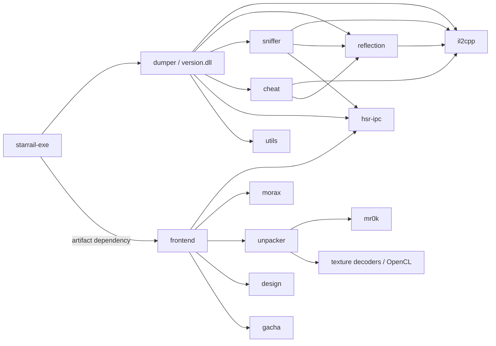
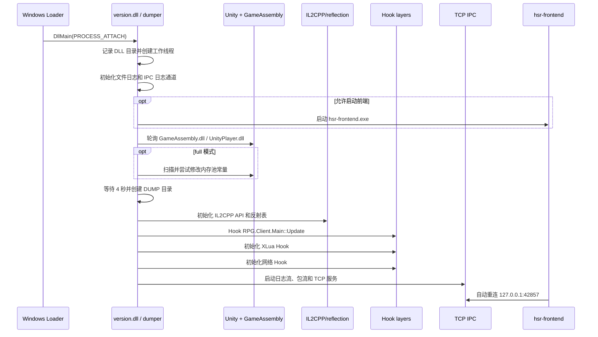
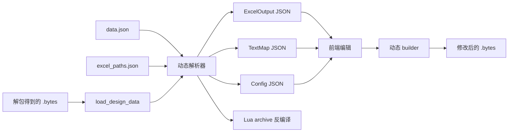

# HSR-OWNER 项目逻辑与架构分析报告

> 分析对象：`D:\Projects\HSR-OWNER`
>
> 分析日期：2026-09-10
>
> 基线：`main` / `11cd291 (BE OWNER)`
>
> 方法：当前源码静态分析、Cargo 工作区枚举、构建链检查，以及本次会话中针对当前游戏客户端的启动验证。

## 1. 结论摘要

HSR-OWNER 是一个面向 Windows 版《崩坏：星穹铁道》的 Rust 综合逆向与修改工具集。它并不是一个功能单一的游戏启动器，而是由三条相互协作的能力链构成：

1. **游戏进程内运行时后端**：以 `version.dll` 代理 DLL 或自定义 `StarRail.exe` 包装器进入游戏进程，初始化 IL2CPP/反射环境，安装主线程、XLua 和网络 Hook，并启动 IPC 服务。
2. **独立桌面前端**：`hsr-frontend.exe` 使用 GPUI 构建，通过本机 TCP 与进程内后端通信，提供 Dumper、抓包、Lua、Cheat、资源解包、DesignData 编辑、跃迁统计、UID 面板等页面。
3. **离线分析工具库**：Morax、Unpacker、Design、Gacha 等 crate 可以对游戏文件、资源包、缓存和导出数据执行离线解析，不是所有功能都依赖注入成功。

当前源码能够做到的事情远多于 README 所说的“纯研究型 dumper”：

- 运行时枚举和导出 IL2CPP 类型、方法、字段、Proto、脚本元数据和游戏配置资源；
- Hook 客户端网络收发、解析帧结构、截获 XOR 密钥、重放或注入数据包；
- 在游戏 Lua VM 中执行脚本；
- 启用隐藏 UI、解除 FPS、速度、加载场景、UID/HUD、审查相关模块；
- 解包 Unity `.block` 资源并导出纹理、文本和字体；
- 解析、编辑并重新构建 DesignData；
- 从 Chromium 磁盘缓存发现跃迁记录 URL 并统计抽卡结果；
- 分析 UID/自身角色、光锥、遗器、行迹和面板数据。

最重要的部署结论是：

- **不建议用仓库生成的超大 `StarRail.exe` 覆盖官方 EXE。** 当前客户端实测会在 Unity 初始化阶段崩溃。
- **当前可行路线是保留官方 `StarRail.exe`，将构建出的 `version.dll` 放到游戏根目录。** `UnityPlayer.dll` 会导入 `VERSION.dll`，代理 DLL 在转发系统版本 API 的同时启动 HSR-OWNER 后端。
- 游戏启动后把根目录 `version.dll` 改名为 `version.dll.<随机数字>` 的行为已经复现，但 HSR-OWNER 源码中不存在这段重命名逻辑；具体执行者尚未由进程监控证实。

## 2. 证据等级说明

本报告对结论使用以下等级：

- **源码已证实**：能在当前 checkout 中找到定义、调用点和数据流。
- **本机实测**：本次会话已经在用户当前游戏目录、当前客户端上运行验证。
- **合理推断**：由多处源码或运行现象共同支持，但没有捕获到决定性运行证据。
- **需要运行验证**：静态结构存在，但是否适配当前游戏版本、当前资源或当前账号状态，必须实际运行确认。

编译成功只说明 Rust、C/C++、链接依赖和资源嵌入能够完成，不等于所有签名扫描、反射名称、网络结构和游戏内行为都仍然有效。

## 3. 仓库规模与技术栈

### 3.1 规模

当前仓库约有 673 个受枚举文件。`crates` 下自有 Rust 代码约 6.05 万行；若计入两个 vendored 纹理解码库，总量约 7.1 万行。

| 目录/模块 | Rust 文件数 | 约代码行数 | 主要职责 |
|---|---:|---:|---|
| `frontend` | 123 | 17,282 | 桌面 UI、状态管理、页面逻辑、IPC 客户端 |
| `dumper` | 118 | 15,880 | 注入入口、运行时导出、XLua、IPC 服务 |
| `design` | 69 | 8,085 | DesignData 解析、动态 schema、编辑和重建 |
| `morax` | 48 | 6,170 | 混淆 IL2CPP 元数据离线恢复 |
| `unpacker` | 26 | 3,923 | Unity 资源包和对象解析、资源导出 |
| `reflection` | 17 | 2,934 | IL2CPP 反射封装和方法表恢复 |
| `gacha` | 14 | 1,603 | 跃迁 URL 发现、记录获取和统计 |
| `il2cpp` | 21 | 1,491 | IL2CPP API、对象模型、原生方法调用 |
| `sniffer` | 8 | 677 | 网络函数定位、Hook、解密、抓取和注入 |
| `ipc` | 8 | 524 | 前后端协议、帧格式和 TCP 客户端 |
| `crypto` | 9 | 735 | Prism/MR0K 等数据解密 |
| `derive` | 2 | 334 | 过程宏和代码生成辅助 |
| `utils` | 5 | 332 | 模块扫描、Hook 包装和内存操作 |
| `starrail-exe` | 2 | 359 | 自定义游戏 EXE 包装入口 |
| `cheat` | 5 | 213 | 游戏进程内原生修改模块 |

### 3.2 技术栈

- Rust 2024 edition，Windows x86_64 MSVC。
- Windows API：模块加载、线程、进程、Job Object、内存保护、窗口和图标。
- `ilhook`：x64 原生函数替换和跳板 Hook。
- `iced-x86`：反汇编 getter 等函数以推断字段偏移。
- `patternscan`：在模块内存中扫描签名字节。
- `microseh`：保护部分原生调用，减少访问冲突直接击穿 Rust 边界的概率。
- `prost` / `protobuf` / `protox`：Proto 描述、动态解析和重新编码。
- GPUI / `gpui-component`：Windows 桌面前端。
- `smol`、标准线程和 channel：异步 UI、后台任务与跨线程队列。
- `rayon`：Morax 多输出并行、图像和资源处理。
- `mimalloc`：前端全局分配器。
- `ureq` + rustls：跃迁和 UID 资源的 HTTP 请求。
- `ocl` / OpenCL：BC7 等纹理解码的 GPU 快速路径，失败时回退 CPU。
- Oodle 静态库：游戏资源解压。

Release 配置启用了 `opt-level=3`、fat LTO、单 codegen unit 和 strip，因此最终产物体积、链接时间及调试可见性都与普通 debug 构建差异较大。

## 4. Cargo 工作区与依赖关系

根目录 [Cargo.toml](Cargo.toml) 声明 15 个 workspace member。`derive` 虽未直接列入 members，但作为本地路径依赖被 Cargo 纳入；`anti` 被声明为 workspace dependency，但当前实际依赖图中没有 crate 使用它。



这个依赖图显示项目有一条非常清楚的分层：

- `il2cpp`、`reflection`、`utils` 是底层运行时基础设施；
- `sniffer`、`cheat`、`dumper` 是游戏进程内能力层；
- `hsr-ipc` 是前后端都依赖的协议层；
- `frontend` 只通过 IPC 访问进程内后端，同时直接调用离线工具库；
- `starrail-exe` 把 `dumper` 和前端产物包装到一个自定义 EXE 中。

## 5. 三种进程/运行形态

### 5.1 官方 EXE + `version.dll` 代理注入

这是当前客户端上已经验证可用的运行形态。

1. 保留官方 `StarRail.exe`。
2. 将 `target\release\version.dll` 放到游戏根目录。
3. `UnityPlayer.dll` 请求加载 `VERSION.dll` 时，Windows DLL 搜索顺序优先找到游戏目录中的代理 DLL。
4. 代理 DLL 的 `DllMain` 记录 DLL 所在目录，并创建后端工作线程。
5. `version.def` 将 16 个版本信息 API 转发到 `C:\Windows\System32\version.dll`，避免破坏原本版本查询功能。
6. 后端等待 `GameAssembly.dll` 和 `UnityPlayer.dll` 出现，然后初始化 IL2CPP、反射、XLua、抓包 Hook 和 IPC。

相关源码：

- [crates/dumper/version.def](crates/dumper/version.def)
- [crates/dumper/build.rs](crates/dumper/build.rs)
- [crates/dumper/src/lib.rs](crates/dumper/src/lib.rs)

`DllMain` 会主动排除 `UnityCrashHandler64.exe` 和 `hsr-frontend.exe`，防止代理 DLL 被这些辅助进程加载时重复启动后端。

### 5.2 自定义 `StarRail.exe` 包装器

[crates/starrail-exe/src/main.rs](crates/starrail-exe/src/main.rs) 的行为不是普通启动器拉起官方 EXE，而是：

1. 在自定义 EXE 自身进程内调用 `dumper::start_in_process()`；
2. 从自身嵌入数据中释放 `hsr-frontend.exe` 到 `%TEMP%\hsr-owner-frontend`；
3. 创建启用 `JOB_OBJECT_LIMIT_KILL_ON_JOB_CLOSE` 的 Job Object，使包装器结束时前端也被结束；
4. 动态加载旁边的 `UnityPlayer.dll`；
5. 查找 `UnityMain` 导出并手工传入实例句柄、命令行和窗口显示参数；
6. 在同一进程中直接进入 Unity Player。

该实现试图复刻 Unity 官方引导 EXE，但官方小型 EXE 可能还承担未被这里复刻的初始化、映像布局、保护组件协商或客户端特有逻辑。因此“能调用 `UnityMain`”不代表与官方启动语义等价。

**本机实测**：生成的约 142 MB `StarRail.exe` 覆盖官方 EXE 后会在 Unity 资源初始化期间触发 `0x80000003` 断点异常并退出。排障时还曾使用一个未保留在当前源码中的临时诊断构建，只启动 Unity 而不启动 HSR-OWNER 后端，崩溃仍然复现。`Player.log` 同时出现 CAB 资源损坏、越界位置和 `CakeRaceCatDataItem` 相关调用栈。恢复约 669 KB 的官方 EXE 后游戏恢复正常。

因此当前结论是：

- 崩溃发生在包装 EXE/Unity 启动兼容层，而不是前端、内存池补丁或具体 Hook；
- 自定义 EXE 不应作为当前客户端的默认交付方式；
- 后续若要修复，需针对官方 EXE 的 PE 元数据、入口初始化、参数、加载顺序和保护流程做差异分析。

### 5.3 独立运行 `hsr-frontend.exe`

前端本身可以单独启动。它会不断尝试连接默认地址 `127.0.0.1:42857`：

- 后端未运行时显示 `Backend Offline`；
- 代理 DLL 后端完成初始化并监听后显示 `Backend Connected`；
- Morax、Unpacker、Design、Gacha 等离线能力在不同程度上可不依赖后端；
- Dumper、Sniffer、Lua、Cheat、在线 UID 请求等运行时功能依赖后端和游戏状态。

## 6. 后端完整启动链

当前 [crates/dumper/src/lib.rs](crates/dumper/src/lib.rs) **没有可配置的启动模式开关**。代理 DLL 被游戏进程加载后，会按固定顺序执行：设置 GC 环境变量、初始化日志并启动前端、等待 `GameAssembly.dll` 与 `UnityPlayer.dll`、尝试内存池补丁、初始化 IL2CPP/反射、安装 APC/XLua/Sniffer Hook，最后启动 IPC 服务。

内存池补丁失败会记录警告并继续启动，但当前代码仍然会主动尝试该写入；这与“默认禁用内存补丁”不是一回事。排障过程中使用过 `launcher-only`、`observe`、`no-memory-patch` 和 `full` 等临时诊断构建，以逐层隔离崩溃来源，但这些模式及 `HSR_OWNER_MODE`、`hsr-owner-mode.txt` 均未进入当前源码，不能作为现成功能或部署接口使用。

### 6.1 `run_backend` 的顺序



后端运行顺序具有强依赖性：IL2CPP 和反射必须先成功，`Main::Update`、XLua 与网络 Hook 才能可靠定位。如果中间某一步 `unwrap`、无效指针调用或版本签名失配，整个游戏进程可能直接退出。

### 6.2 内存池补丁

`utils::patch_memory_pool()` 扫描 `GameAssembly.dll` 中的字节模式 `BF 00 00 E0 15`，识别一个写入 EDI 的 350 MB 常量，然后用 `VirtualProtect` 临时改为可写，将立即数改为 1 GB，恢复保护并刷新指令缓存。

本机当前 4.5.5X 客户端未命中该模式，因此 `full` 模式记录警告并跳过，后续初始化仍可继续。这说明：

- 补丁不是当前启动成功的必要条件；
- 签名明显依赖版本；
- 找到相同字节也不自动证明语义仍是目标内存池，更新版本时应结合反汇编验证。

## 7. IL2CPP 与反射恢复

### 7.1 `il2cpp` crate

`il2cpp` 是所有运行时能力的底座，主要职责包括：

- 从已加载模块获取 `GameAssembly.dll` 和 `UnityPlayer.dll` 的内存范围；
- 扫描 UnityPlayer 中的签名以定位 IL2CPP API 表/初始化入口；
- 构建 assembly、image、class、method、field、type 等包装；
- 提供 Il2CppObject、Il2CppString、Il2CppArray 等运行时对象访问；
- 将恢复的方法地址转成原生函数指针并调用；
- 维护方法、类型和模块地址的全局映射。

宏生成的调用包装在部分位置使用 `microseh` 捕获 Windows 结构化异常，但项目中仍有大量裸 `unsafe`、裸指针和 `unwrap`。SEH 只能降低部分访问冲突的影响，不能修复错误签名、ABI 不一致或逻辑上错误的对象布局。

### 7.2 `reflection` crate

`reflection` 在 IL2CPP 原生对象上重建近似 .NET Reflection 的访问方式：

- 获取程序集和类型；
- 枚举字段、属性、方法、参数和返回类型；
- 生成完整的方法签名到地址的索引；
- 为 dumper、sniffer、cheat 提供按结构/签名查找的能力；
- 可导出反射方法数据。

初始化会枚举大量方法和类型。本次成功运行的日志中记录约 740,837 个 IL2CPP 方法、82,301 个类型，以及约 599,667 个反射方法。

该模块包含一个有限的名称修正机制：当混淆后的方法名末尾是数字且版本更新导致数字偏移时，会在一定范围内尝试调整并执行自检。它提高了小幅版本变化时的容错能力，但不是“自动适配任何版本”：

- 类型布局变化、方法签名变化、常量变化或调用约定变化仍需人工更新；
- 非数字混淆名无法靠这个逻辑恢复；
- 自检覆盖不到的错误仍可能在后续 Hook 时暴露。

## 8. 游戏主线程调度

[crates/dumper/src/apc_thread.rs](crates/dumper/src/apc_thread.rs) Hook `RPG.Client.Main::Update()`，将每帧 Update 变成 HSR-OWNER 的主线程调度点。每一帧主要执行：

1. 调用原始 `Main::Update`；
2. 排空等待在游戏主线程执行的任务；
3. 执行待处理 Lua 脚本；
4. 更新 cheat 模块状态；
5. 检查按键绑定并产生触发事件。

这是项目里非常关键的架构选择。许多 Unity/IL2CPP 对象只能安全地在游戏主线程访问；IPC 线程不能直接完成这些操作，所以会把闭包/任务放入队列，再由 Update Hook 执行。

风险也集中在这里：

- 一个耗时任务会直接增加游戏主线程帧耗时；
- 队列中的 panic、悬空对象或错误函数地址会影响整个游戏；
- Hook 找不到 `RPG.Client.Main::Update()` 时当前代码存在直接 `unwrap` 的崩溃点。

## 9. 前后端 IPC

### 9.1 传输层

[crates/ipc/src/transport.rs](crates/ipc/src/transport.rs) 定义默认地址 `127.0.0.1:42857`。可通过 `HSR_OWNER_ADDR` 覆盖。

每个消息的线格式是：

```text
[4 字节 little-endian JSON 长度][UTF-8 JSON]
```

客户端维护：

- 一个可重连写连接；
- 自增 request id；
- request/reply 等待表；
- 后端事件订阅者列表；
- 断线后每 250 ms 重连。

后端为每个 TCP 客户端建立读取与写入线程，使用有界发送队列，并向所有连接广播日志和数据包事件。

### 9.2 命令族

IPC 协议按功能分为：

- `DumperCommand`：执行 Proto、CSharp、ParserData、Script、ScriptV2、Resources 导出；
- `SnifferCommand`：开始/停止、清空、发送包、批量发送、设置 Hook cmd id、提交修改结果；
- `CheatCommand`：启停模块、设置值、设置按键、触发动作；
- `ConfigCommand`：同步 dumper 等运行状态；
- 兼容命令：旧式 `RunDumper`、`StartSniffer`、`ExecuteLua` 等仍被保留。

后端事件包含执行开始/成功/失败、抓到的数据包、修改请求、Cheat 状态、配置状态和日志。

### 9.3 安全边界

默认绑定 loopback，局域网其他主机不能直接连接。但是协议没有身份认证、授权、加密或会话握手。一旦把 `HSR_OWNER_ADDR` 配成对外监听地址，能够连接的进程原则上可以请求：

- 执行 Lua；
- 修改或注入网络包；
- 切换运行时模块；
- 发起高成本 dump。

因此不应将监听地址暴露到局域网或公网；也不应在不可信本机多用户环境下把该接口视为安全边界。

## 10. Dumper 子系统

前端 Dumper 页面把请求发送给游戏内 `dumper`，后端工作线程执行并写入当前工作目录的 `DUMP` 文件夹。

| 动作 | 主要输出 | 作用 |
|---|---|---|
| Proto / `WriteTo` | `StarRail.proto`、`packetIds.json` | 恢复消息定义与 cmd id |
| Proto / `MergeFrom` | 同上 | 按 MergeFrom 相关路径分析字段 |
| Proto / `ClassFieldNumber` | 同上 | 从字段号/类结构恢复 |
| Proto / `Asm` | 同上 | 结合反汇编路径恢复 |
| CSharp | `dump.cs` | 输出类型、字段、属性和方法定义 |
| ParserData | `data.json`、`excel_paths.json`、`mod.rs` | 为 DesignData 动态解析器生成 schema 与 Excel 路径 |
| Script | `script-mini.json` 等 | 导出脚本/方法使用相关数据 |
| ScriptV2 | `script.json`、`stringLiterals.json`、`struct.h` | 第二套脚本与结构导出 |
| Resources | `DUMP/Resources/...` | 运行时导出 ExcelOutput、TextMap、Config 等资源 |

Proto 恢复不是单一算法，四种模式反映作者针对不同混淆/实现形式准备了多条取证路径。适合的模式取决于当前版本代码生成方式；某一模式生成文件不代表字段语义百分之百正确，仍应对关键消息做收发样本校验。

## 11. 网络 Sniffer

### 11.1 目标函数定位

Sniffer 没有把所有地址硬编码为 RVA，而是结合运行时结构查找：

1. 在程序集名中查找包含 `RPG.Network.MiNet` 的 assembly；
2. 通过字面量字段常量 `120000` 定位网络包类；
3. 在类中寻找签名为 `(byte[], int, int) -> int` 的两个方法作为收包/发包候选；
4. 通过常量 `340870469` 定位 XOR 类；
5. 反汇编属性 getter，比较内存 displacement 与字段 offset，确定 XOR key 字段。

这种“结构 + 常量 + 签名 + 反汇编”方式比纯 RVA 更抗小版本变动，但常量和类结构一旦变化仍会失效。

### 11.2 数据包格式

[crates/sniffer/src/net_packet.rs](crates/sniffer/src/net_packet.rs) 解析的帧为大端字段：

```text
u32 head_magic = 0x9D74C714
u16 cmd_id
u16 head_len
u32 body_len
byte[head_len] header
byte[body_len] body
u32 tail_magic
```

代码验证头 magic，但当前 `from_slice` 只读取、没有强制校验尾 magic 是否等于预期值。对损坏或伪造数据进行工具级解析时，这是一个可改进点。

### 11.3 解密、捕获和修改

- Hook 层从游戏连接对象提取/保存 XOR 上下文；
- 根据序列号对数据执行 XOR 还原或重新加密；
- 解析成功的包进入容量为 8192 的同步通道；
- IPC 将其广播给前端；
- 前端根据 `packetIds.json`/Proto schema 映射 cmd id 与消息名并解码 body。

用户可指定需要“拦截修改”的 cmd id。对应包到达 Hook 后，游戏网络线程最多等待前端 50 ms：

1. 后端产生 `PacketModifyRequest`；
2. 前端解码 Proto，并依次运行手动修改器和 Cheat 修改器；
3. 前端把修改后的 body 或 `drop_packet=true` 发回；
4. 后端重建帧并重新 XOR，或丢弃该包；
5. 超过 50 ms 没有响应时沿用原始包。

这是一个明确的实时性能风险点。复杂 JSON 修改、大量被 Hook 的 cmd id、UI 卡顿或 IPC 拥堵都可能为网络线程增加几十毫秒延迟。

### 11.4 自定义发包

自定义客户端包和服务端包最终通过 `Main::Update` 队列切回游戏主线程。后端为任务设置等待超时，并返回成功/失败事件。这里不是建立独立网络连接，而是借用已 Hook 的游戏收发路径和当前会话密钥。

## 12. XLua / Luau 执行链

`dumper::xluau` 会查找 `xluau.dll` 的导出：

- `luau_load`；
- 可选的 `xluaL_loadbuffer`；
- `lua_pcall`；
- `lua_settop`。

通过替换加载函数捕获有效 Lua state，之后前端 Lua 页面可：

- 立即提交脚本；
- 把脚本登记为 load 时执行；
- 由 `Main::Update` Hook 在游戏主线程实际运行。

“执行成功”依赖至少三个条件：目标导出仍存在、函数 ABI 未改变、已经捕获到可用 Lua state。若只看到前端连接而未发生脚本加载，Lua 页面不一定立刻可用。

代码中实时字节码路径会通过 `VirtualAlloc` 分配可读写执行内存；在本次静态检查到的函数范围内没有看到对该缓冲区的对应释放。这可能导致多次执行后的内存增长，应通过生命周期跟踪确认并补充 `VirtualFree` 或复用缓冲区。

## 13. Cheat 子系统与 README 差异

README 开头声称“all illicit cheat features have been completely stripped out”，但当前源码同时存在 [crates/cheat](crates/cheat) 和 [crates/frontend/src/cheat](crates/frontend/src/cheat)，且前端明确注册了七个模块：

| 模块 | 默认状态/行为 | 实现方式 |
|---|---|---|
| Unlock FPS | 默认启用，约每 20 ms 发送脚本 | Lua 设置目标帧率，默认值 144 |
| Speed | 默认关闭 | 周期性构造并注入服务端 `SyncEntityBuffChangeList` |
| Loading Scene | 默认启用 | 监听登录/场景包并周期执行加载场景 Lua |
| Hide UI | 可切换 | 后端周期修改 UI Camera enabled 状态 |
| UID | 默认启用 | 登录响应后周期执行 UID 相关 Lua |
| HUD | 可配置 | 前端模块 + Lua/包处理链 |
| Censorship | 可切换 | 原生 Hook 强制返回特定结果 |

后端 `cheat` crate 当前直接实现的原生逻辑较少，更多高级行为位于前端模块：前端通过 Proto 解码、包修改和 Lua 命令组合出功能。

所以准确表述应是：**仓库保留了具备游戏行为修改、包修改与脚本执行能力的模块，README 的“已完全移除”与源码事实不一致。**

这些功能可能违反游戏服务条款并带来封号、数据异常或客户端崩溃风险。本报告只描述代码事实，不对在线使用的安全性作保证。

## 14. Morax 离线元数据恢复

Morax 不需要先注入游戏。前端默认从当前工作目录读取：

- `GameAssembly.dll`；
- `StarRail_Data\il2cpp_data\Metadata\global-metadata.dat`；
- `StarRail_Data\il2cpp_data\Metadata\startup-metadata.dat`。

`Metadata::load` 的核心步骤是：

1. 解析 GameAssembly PE 映像和 image base；
2. 通过代码模式发现 MetadataCache Register、CodeRegistration、MetadataRegistration 和 usage 结构；
3. 识别加密/混淆后的 global metadata header 和 payload offset；
4. 解析 startup metadata；
5. 恢复 image、type、field default value、method pointer、invoker、generic instantiation 和 usage 表；
6. 建立字符串、类型名和泛型容器缓存。

成功后使用 Rayon 并行生成 `Morax` 目录中的五类结果：

- `dump.cs`；
- `script.json`；
- `il2cpp.h`；
- `stringLiterals.json`；
- `DummyDll\`。

这条链路的价值是：即使运行时 Hook 尚未适配，也可以先从落盘文件恢复大量静态信息。限制是动态生成、运行期解密、JIT/Lua 状态和实际网络密钥仍必须运行时观察。

## 15. Unpacker 资源解包

Unpacker 页面提示用户选择 `StreamingAssets\Asb\Windows`。底层流程是：

1. 递归收集扩展名为 `.block` 的文件；
2. 使用内存映射读取，减少大文件重复拷贝；
3. 识别并解压游戏的加密 archive，游戏类型固定为 `Hkrpg`；
4. 跳过独立 `.resS` 条目，并解析 Unity SerializedFile；
5. 从 AssetBundle container 表建立 path id 到资源路径的映射；
6. 枚举对象，只处理选中的 Texture2D、TextAsset、Font；
7. 按容器路径过滤并导出；
8. 对单个解码失败和 panic 做隔离，累计 extracted/skipped/errors 统计。

前端还提供：

- 文件夹加载、资源树和搜索；
- 纹理缩略图和大图预览；
- 复制预览图；
- 按选项批量导出。

纹理解码支持多种 Unity 格式。BC7 等格式优先尝试 OpenCL GPU 路径，任何 OpenCL 初始化/执行错误都会静默回退 CPU，因此 `OpenCL.lib` 是 Windows 链接期依赖，但运行时不一定必须有可用 GPU OpenCL 平台。

Oodle 通过 [crates/unpacker/build.rs](crates/unpacker/build.rs) 静态链接 `Assets\oodle\oo2core_win64.lib`。这也是完整前端构建不能只看纯 Rust 依赖的原因。

## 16. DesignData 解析、编辑与重建

`design` crate 处理从游戏资源中得到的 `.bytes` DesignData。它依赖 Dumper 输出的 schema：

- `data.json`：类型结构描述；
- `excel_paths.json`：ExcelOutput 类型与逻辑路径映射。

完整处理链：



源码支持三种粒度：

- `parse_all`：尽力导出 Excel、TextMap，并严格处理 Config；
- 分类解析：单独解析 Excel、TextMap、Config；
- `build_one` / `build_files` / `build_edits`：把 JSON 修改重新编译为二进制。

重建时只输出被标记为 modified 的数据文件，并提供 `change_md5` 选项。临时编辑目录使用 `%TEMP%\hsr-traingame-build`。

值得注意的容错策略：Excel 和 TextMap 的部分解析使用 `best_effort` + `catch_unwind`，失败可能被吞掉；这有利于一次任务尽量多产出，但也可能造成“整体显示完成、某个分类实际缺失”。二次开发时应把每一类输出数量和错误单独呈现。

## 17. Gacha 跃迁记录

Gacha 的实现没有读取游戏进程内存，而是解析游戏内嵌 Chromium 的磁盘缓存：

1. 定位 `StarRail_Data\webCaches`；
2. 按版本号选择最新缓存目录；
3. 打开 `Cache\Cache_Data`；
4. 枚举长 key，筛选包含 gacha API 与 `authkey=` 的 URL；
5. 解析国内服/国际服和查询参数；
6. 对候选 URL 发一个小请求验证 authkey；
7. 分批并发抓取多个卡池的所有分页记录；
8. 去重、排序并统计保底、平均抽数、角色/光锥分类等数据；
9. 下载条目图标供前端显示。

支持的 gacha type 包括 1、11、12、2 和联动端点 21、22。请求每页 20 条，最多三个卡池并行；网络错误指数退避，频率限制错误会延迟重试，authkey 失效会提示重新在游戏内打开跃迁历史。

隐私边界：跃迁 URL 含 authkey，等同短期访问凭据。当前逻辑用于内存中请求，没有理由把完整 URL写入公开日志、报告或分享文件；调试时应主动打码。

## 18. UID 面板分析

UID 页面支持两条数据源：

### 18.1 查询其他 UID

- 用户输入数字 UID；
- 前端通过已安装 transport 向后端请求详情；
- 等待与目标 UID 匹配的 `detail_info` JSON；
- 约 8 秒未收到匹配响应则提示游戏、注入或 Proto 未就绪；
- 解析玩家基础资料、展示角色和助战角色。

### 18.2 分析自身账号

- 前端监听并保存角色列表响应和背包响应；
- 用户需在游戏内打开角色界面以触发数据；
- 将角色、装备、遗器、行迹和资源表组合成本地 `DisplayAvatar`；
- 按稀有度、等级、六件遗器完整性、评分和角色 id 排序。

面板计算包括：

- 角色等级/突破成长属性；
- 光锥基础属性、突破和叠影；
- 遗器主词条、副词条、套装效果；
- 行迹加成和技能等级；
- 按角色权重计算遗器有效词条与评级；
- 中文/英文文本和图标渲染。

资源数据库会从在线数据源下载版本、角色、光锥、遗器、词条、路径、属性和 TextMap 等 JSON。因而 UID 页面“后端已连接”仍不保证面板可加载；还需要网络可达、远端 schema 与当前代码兼容。

## 19. 前端页面总览

前端窗口默认 980×640，左侧导航共 11 页：

| 页面 | 是否依赖游戏内后端 | 主要用途 |
|---|---|---|
| Dumper | 是 | 触发运行时各类导出 |
| Morax | 否 | 离线恢复混淆 IL2CPP 元数据 |
| Sniffer | 是 | 抓包、筛选、Proto 查看、修改、重放、导入导出 |
| Cheat | 是 | 管理 Lua/包修改/原生 Hook 组合模块 |
| Lua | 是 | 编辑和执行 Lua/Luau |
| Unpacker | 否 | 扫描 `.block`、预览与导出资源 |
| Design | 通常否 | 解析、浏览、编辑和重建 DesignData |
| Gacha | 否，但需游戏缓存 | 获取并统计跃迁历史 |
| UID | 是，且部分资源需联网 | 查询或构建角色面板 |
| Config | 前端本地 + 后端同步 | 保存过滤、Hook、Cheat、键位和开关 |
| Console | 连接后端时最完整 | 查看前端与后端实时日志 |

Console 最多保留 5000 行，支持 Follow、Copy All 和 Clear。前端本地日志与后端广播日志汇合后展示。

## 20. 配置与路径语义

Config 页面保存：

- 过滤的消息名；
- Hook 的消息名；
- 启用的 Cheat 模块；
- 按键绑定；
- 各模块参数值；
- Dumper enabled 状态。

配置目录由 `current_dir().join("Config")` 决定，不是固定在 EXE 目录，也不是 `%APPDATA%`。因此从不同工作目录启动同一个前端，可能看到不同的配置集合。

每个配置是 `Config\<名称>.json`，当前 schema version 为 1；最近加载项保存在 `Config\.last_loaded`。名称校验拒绝 Windows 非法路径字符、`.` 和 `..`。

同样，Dumper 的 `./DUMP`、Morax 的相对游戏文件、Design 的输入输出都不同程度依赖当前工作目录。部署脚本应先 `cd /d` 到游戏根目录再启动，避免“文件存在但程序找不到”的问题。

## 21. 构建系统和产物

### 21.1 构建要求

- Windows x64；
- Rust nightly + MSVC toolchain；
- Visual C++/Windows SDK 链接工具；
- `Assets\oodle\oo2core_win64.lib`；
- OpenCL import library。

当前机器的 `OpenCL.lib` 位于：

```text
D:\Tools\vcpkg\installed\x64-windows\lib\OpenCL.lib
```

推荐只对当前构建进程扩展 `LIB`：

```powershell
$env:LIB = "D:\Tools\vcpkg\installed\x64-windows\lib;$env:LIB"
cargo build --release
```

不要把 OpenCL 目录误当运行时 DLL 目录。这里解决的是 MSVC 链接阶段寻找 `OpenCL.lib`；运行时由系统/显卡驱动提供 OpenCL DLL 和平台实现，失败时纹理解码代码可回退 CPU。

### 21.2 主要产物

| 命令 | 主要产物 | 建议用途 |
|---|---|---|
| `cargo build -p dumper --release` | `target\release\version.dll` | 推荐的游戏进程内后端载入方式 |
| `cargo build -p frontend --release` | `target\release\hsr-frontend.exe` | 单独运行桌面 UI |
| `cargo build -p starrail-exe --release` | `target\release\StarRail.exe` | 自定义 Unity 包装器；当前客户端不建议替换官方 EXE |
| `cargo build --release` | 默认成员及包装器依赖产物 | 完整构建，但并不代表每个运行时功能可用 |

`starrail-exe` 使用 Cargo artifact dependency 在构建时取得前端二进制，并通过 `include_bytes!` 嵌入 EXE。若 build script 看不到 `CARGO_BIN_FILE_FRONTEND*`，会嵌入空占位并在运行时尝试旁边的 `hsr-frontend.exe`。

### 21.3 推荐部署

```text
游戏根目录\
├─ StarRail.exe              官方原版，保留
├─ UnityPlayer.dll           游戏原文件
├─ GameAssembly.dll          游戏原文件
├─ version.dll               HSR-OWNER 构建产物
├─ hsr-frontend.exe          可选；代理 DLL 也可从自身目录寻找/启动
├─ Config\                   前端配置
└─ DUMP\                     运行时导出结果
```

当前没有配置文件可关闭内存池补丁。它在本次客户端上因签名未命中而记录警告并跳过，但这只是当前版本的运行结果，不是稳定的安全开关。若要长期部署，建议后续把该补丁改成显式配置、默认关闭，并在确认目标版本签名与写入语义后再启用。

## 22. 本次实际验证结果

### 22.1 已通过

- `cargo build -p dumper --release` 成功；
- 设置 `LIB` 后完整 UI/包装器 Release 构建成功；
- 排障期间的临时诊断构建分别验证了：仅代理 DLL/Unity 启动、模块观察、不执行内存池补丁的完整后端，以及包含补丁尝试的完整后端；这些诊断模式没有保留在当前源码中；
- 官方 `StarRail.exe` + 当前代理 `version.dll` 启动成功；内存池签名未命中后记录警告并继续，前端连接、IL2CPP/反射初始化、Main Update、XLua、Sniffer Hook 和 IPC 监听均成功；
- 使用启动脚本恢复代理 DLL再启动的端到端流程成功，游戏和前端均保持运行且后端已连接。
- 修复后的 Proto `WriteTo` 在未手工先执行 Script Dumper 的情况下完成，耗时约 15 秒，并生成可解析的 `packetIds.json` 与 `StarRail.proto`；当前版本的命令名仍未完成反混淆适配。

### 22.2 已确认失败

- 用构建出的自定义大体积 `StarRail.exe` 替换官方 EXE，在当前客户端上会进入 Unity 后崩溃；
- 未启动后端的临时诊断构建中同样发生，因此不能归因于后端 Hook 或内存池写入。

### 22.3 尚未解释

每次启动后，根目录 `version.dll` 会被改名为类似：

```text
version.dll.4266759282
version.dll.108211383
```

当前结论：

- HSR-OWNER 全仓库没有找到重命名 `version.dll` 的逻辑；
- 未发现能直接说明是 Windows Defender 隔离的事件；
- 随机数字后缀和启动时机更像游戏启动/保护/补丁组件对根目录代理 DLL 的处理，但这只是合理推断；
- 在没有 Process Monitor 文件操作栈或进程级事件前，不能断言具体执行者。

实用规避方案是把稳定副本放在游戏目录外或专用子目录，在每次启动前复制回游戏根目录。要查明根因，应使用 Process Monitor 过滤 `Path ends with \version.dll` 及 `Rename`/`SetRenameInformationFile`，记录发起进程和调用栈。

## 23. 代码质量与主要风险

### 23.1 自动化测试非常少

当前 `crates` 范围内只发现一个显式 `#[test]`，用于验证运行模式字符串解析。对以下高风险逻辑没有仓库内自动化回归保障：

- IPC 帧边界和异常长度；
- Proto 编解码与包重建；
- 网络帧尾 magic；
- Unity SerializedFile 边界；
- Morax PE/metadata 版本变体；
- DesignData round-trip；
- 配置升级；
- Lua 缓冲区生命周期。

此外，`dumper` 的 `version.def` 把 `/OUT:version.dll` 带入 test harness 链接，导致测试可编译但测试 EXE 链接/执行流程冲突。这应在 build script 中仅对 `cdylib` 目标施加 DEF，或拆分导出 DLL 与可测试核心库。

### 23.2 `unsafe` 和失败策略

静态粗略统计在 `crates` 中发现约 325 行含 `unsafe`，约 875 行含 `unwrap`/`expect`，约 21 行含 `panic!`/`todo!`/`unimplemented!`。这些数字不是缺陷数量，但体现了项目风险画像：

- 离线工具崩溃通常只损失当前任务；
- 游戏进程内任何 panic、非法地址或 ABI 错误都可能让游戏一起退出；
- 很多版本适配失败没有降级成“功能不可用”，而是直接 unwrap。

### 23.3 版本耦合

高耦合点包括：

- UnityPlayer/IL2CPP API 签名扫描；
- 反射混淆方法名；
- `RPG.Client.Main::Update()` 精确签名；
- 网络程序集、常量和方法结构；
- XOR 对象布局；
- XLua 导出名和 ABI；
- Proto cmd id 和字段号；
- DesignData schema、加密和 MD5；
- Morax metadata header 格式。

README 的“基本自动适配所有新版本”属于项目声明，不能从源码和一次当前版本运行推广到未来版本。

### 23.4 日志和可诊断性

当前代码已经把后端日志写入游戏根目录的 `hsr-owner.log`，包装器写 `hsr-owner-launcher.log`，同时通过 IPC 推送 Console。这个改动显著改善了“窗口一闪而过、没有日志”的问题。

仍建议为以下阶段增加结构化检查点和错误码：

- DLL 被哪个进程加载；
- 两个关键模块等待耗时；
- 每个签名扫描结果和候选数；
- IL2CPP/反射初始化阶段计数；
- 每个 Hook 的地址、原始字节 hash 和安装结果；
- IPC bind 地址和失败原因；
- Lua state 捕获次数；
- packet modify 超时计数；
- 各 dumper 输出数量和失败数量。

## 24. 二次开发建议

### 24.1 第一优先级：固定可靠启动路线

将交付模型明确为：

```text
官方 StarRail.exe + 启动前恢复的 version.dll + 独立 hsr-frontend.exe
```

把 `starrail-exe` 标记为实验性，不再让 README 默认引导用户覆盖官方 EXE。启动器应只做复制代理 DLL、设置模式、启动官方 EXE、收集日志，不应复刻 `UnityMain`。

### 24.2 第二优先级：把后端变成分阶段状态机

建议将当前线性启动改为可观测状态：

```text
DllLoaded
→ ModulesReady
→ Il2CppReady
→ ReflectionReady
→ MainThreadHooked
→ LuaReady/Unavailable
→ SnifferReady/Unavailable
→ IpcReady
```

前端状态卡应展示每个子系统，而不是只有 Connected/Offline。这样“IPC 已连接但 Lua 未捕获”“反射可用但 Sniffer 签名失效”不会被误判成整体成功。

### 24.3 第三优先级：消除游戏进程内的硬崩溃点

- 把关键 `unwrap` 改为带上下文的 `Result`；
- 每个 Hook 安装前验证地址落在可执行节；
- 保存并检查目标位置原始字节；
- 单个可选模块失败时禁用该模块，不终止整个后端；
- 给主线程任务设置预算和耗时日志；
- 回收 XLua 动态执行缓冲区；
- 限制 IPC frame 最大长度，防止异常长度导致大分配。

### 24.4 第四优先级：建立离线回归样本

保存经过脱敏的小型固定样本并测试：

- 一个网络包帧；
- 一组 Proto schema 和 JSON round-trip；
- 一个 Unity SerializedFile/.block 样本；
- 一份 Morax metadata 头；
- 一个 DesignData 类型和编辑 round-trip；
- 一份 Config v1；
- 一份去掉 authkey 的 gacha API 响应。

这些测试不需要启动游戏，却能覆盖项目中大量纯逻辑。

### 24.5 第五优先级：澄清功能与合规说明

README 应真实列出：

- 哪些功能只读；
- 哪些功能写游戏内存；
- 哪些功能修改/注入网络包；
- 哪些功能执行游戏脚本；
- 当前验证过的游戏版本；
- 推荐部署方式和回滚方式；
- 账号、服务条款和数据备份风险。

这比笼统声称“cheat 已移除”更有助于使用者做出知情决定。

## 25. 推荐的使用顺序

对于首次部署或版本更新后的验证，建议按以下顺序逐层确认：

1. 恢复官方 `StarRail.exe` 并确认纯游戏可启动；
2. 构建 `version.dll` 和独立前端；
3. 启动前复制 `version.dll` 到游戏根目录；
4. 检查 `hsr-owner.log`，确认游戏存活且后端完成模块发现、IL2CPP/反射、Hook 和 IPC 初始化；
5. 确认前端显示 `Backend Connected`；
6. 先执行 CSharp/Proto 等以导出为主的功能；Proto 会在所需 Script 元数据缺失时自动补做 Script dump；
7. 再测试抓包查看，不启用修改；
8. 最后才分别测试 Lua、包注入或 Cheat 功能；
9. 若内存池签名重新命中，先停止验证并核对目标地址和写入语义；当前源码没有禁用该补丁的配置开关。

每一步都应记录“成功表现”和“失败表现”。由于当前没有分级启动模式，若发生启动期崩溃，应结合日志和调试构建逐项隔离初始化阶段，不能依赖不存在的模式配置回退。

## 26. 最终判断

从架构角度看，HSR-OWNER 的强项是把运行时逆向、网络观察、离线资源解析和可视化操作统一在一个 Rust 工作区中，并通过 IPC 把高风险的游戏进程内逻辑与 UI 分离。Morax、Unpacker、Design 和 Gacha 的离线能力也让它不只是一个注入器。

它目前的主要问题不是“没有功能”，而是功能很多、版本耦合高、测试少、错误隔离不足，且文档与实际能力不一致。当前最可靠的落地方式已经通过实测确定：**保留官方 EXE，使用 `version.dll` 代理注入；同时注意当前源码会尝试内存池补丁，只是在本次客户端上因签名未命中而跳过。**

如果后续目标是稳定维护，而不是一次性逆向，优先工作应是启动状态机、错误隔离、离线回归样本和真实的版本兼容矩阵，而不是继续扩大前端功能数量。
