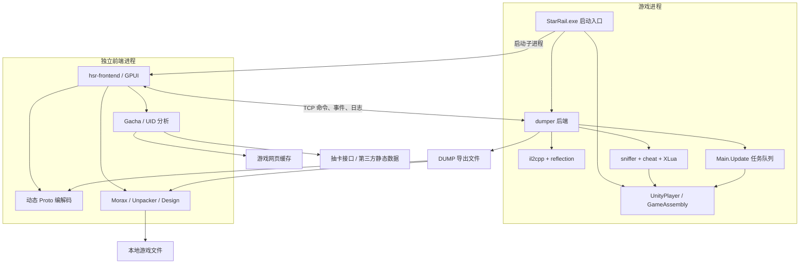
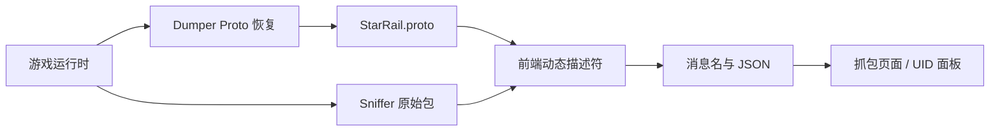
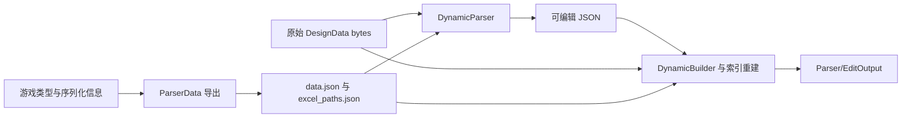

# HSR-OWNER 项目源码详细分析

分析日期：2026-09-24  
分析版本：本地 Git 提交 `11cd291`（提交日期 2026-08-22，提交说明 `BE OWNER`）  
分析范围：工作区清单、构建配置、启动入口、11 个前端页面、核心后端与数据处理链路、关键错误处理和外部依赖。  
验证方式：源码静态分析、调用关系核对、文件与行数统计；**未编译、未启动游戏、未实际调用在线接口**。当前 PowerShell 环境中未检测到可用的 `cargo`、`rustc`、`rustup` 命令。

文中的“已实现”表示存在实际源码和调用路径，不表示已在当前游戏版本上验证成功。网络地址、概率参数与游戏类型均描述本仓库的实现，不代表对外部服务当前状态或游戏规则的独立核验。

## 目录

1. [项目到底是什么](#1-项目到底是什么)
2. [源码规模与目录职责](#2-源码规模与目录职责)
3. [整体架构与进程关系](#3-整体架构与进程关系)
4. [启动与运行逻辑](#4-启动与运行逻辑)
5. [完整功能清单](#5-完整功能清单)
6. [各功能的实现原理](#6-各功能的实现原理)
7. [核心业务链路](#7-核心业务链路)
8. [输入输出与数据存储](#8-输入输出与数据存储)
9. [技术选型与工程特点](#9-技术选型与工程特点)
10. [构建条件与运行前提](#10-构建条件与运行前提)
11. [实现边界与具体问题](#11-实现边界与具体问题)
12. [维护与改进顺序](#12-维护与改进顺序)
13. [建议的源码阅读路线](#13-建议的源码阅读路线)
14. [验证记录与结论](#14-验证记录与结论)
15. [源码索引](#15-源码索引)

## 1. 项目到底是什么

### 1.1 一句话说明

**HSR-OWNER 是一个面向 Windows 版《崩坏：星穹铁道》的原生桌面分析和修改工具集合：通过游戏进程内的 Rust 后端获取运行时信息，通过独立图形前端组织导出、协议查看、Lua 执行、资源解析、配置编辑和账号数据分析。**

它主要处理三类对象：

| 对象 | 代表内容 | 工具提供的能力 |
| --- | --- | --- |
| 运行中的游戏客户端 | IL2CPP 类型、字段、方法、Lua 状态、收发协议 | 类型导出、协议恢复、抓包、执行脚本、修改客户端行为 |
| 游戏安装目录中的文件 | 元数据、`.block` 资源、DesignData、Lua 归档、网页缓存 | 离线解析、图像导出、配置转 JSON、配置重新编码、抽卡链接提取 |
| 协议和在线接口返回的数据 | 抽卡记录、玩家详情、角色、光锥、遗器 | 可视化查看、统计、面板计算、遗器评分 |

### 1.2 定位与边界

- 主要应用以 Rust 编写，前端采用 GPUI；没有本项目自有的 Web 页面服务架构。
- `StarRail.exe` 是工具构建的启动程序，会加载游戏的 `UnityPlayer.dll` 并调用 `UnityMain`，所以不是脱离游戏文件即可工作的完整游戏客户端。
- `dumper` 同时提供进程内库与 `version.dll` 形式的动态库入口；独立 UI 是 `hsr-frontend.exe`。
- 源码含有客户端修改功能和自定义协议收发能力，不能仅把它归类为只读查看器。
- 本仓库未提供完整游戏服务器业务实现。协议导出、类型导出也不等于还原完整游戏源码。
- README 宣称“完全移除非法作弊功能”“内置 anti-anti-cheat”，但源码与目录不能完整支持这些表述：当前仍注册多个修改模块，而 `crates/anti` 目录并不存在。应分别看待宣传文字、实际源码和运行验证结果。

### 1.3 谁会使用这些功能

从功能设计推断，主要使用者是需要研究客户端结构、检查资源与协议、查看数据、修改本地配置或脚本的开发者；抽卡与遗器页面则提供更接近普通玩家需求的数据展示。整体工程的使用门槛主要来自游戏运行环境、版本适配和运行时依赖。

## 2. 源码规模与目录职责

### 2.1 规模统计

统计 `crates` 和 `lib` 目录中的 `.rs` 文件，共 **545 个文件、78,493 行物理文本行**。行数包含空行、注释、构建脚本及内置第三方代码，不等于有效业务代码行数。

- `crates`：475 个 Rust 文件，67,138 行。
- `lib`：70 个 Rust 文件，11,355 行。
- `frontend` 与 `dumper` 合计 36,552 行，是业务实现最集中的两部分。
- 根清单显式列出 15 个 workspace member 和 8 个 default member；`derive` 及纹理解码库另以本地路径依赖出现。没有执行 Cargo 元数据解析，因此不将显式列表数量等同于 Cargo 最终解析出的全部工作区包数。

| 模块目录 | Rust 文件数 | 物理行数 | 职责 |
| --- | ---: | ---: | --- |
| `crates/frontend` | 123 | 18,729 | GPUI 图形界面、协议动态编解码、功能协调、账号面板 |
| `crates/dumper` | 118 | 17,823 | 进程内后端、导出、IPC 服务、Lua 集成 |
| `lib/texture2ddecoder` | 37 | 9,604 | 内置压缩纹理解码库，统计含 Python 绑定中的 Rust 文件 |
| `crates/design` | 69 | 8,880 | DesignData 解析、修改、重建及 Lua 反编译 |
| `crates/morax` | 48 | 6,786 | 磁盘 IL2CPP 元数据恢复与分析文件生成 |
| `crates/unpacker` | 26 | 4,403 | 游戏资源归档解包、Unity 对象解析与导出 |
| `crates/reflection` | 17 | 3,316 | 托管反射对象、成员访问、序列化封装 |
| `crates/gacha` | 14 | 1,805 | 网页缓存、抽卡 URL、接口抓取与统计 |
| `lib/texture_decoder` | 33 | 1,751 | 纹理像素格式转换与解码适配 |
| `crates/il2cpp` | 21 | 1,714 | IL2CPP API 定位、运行时类型与方法缓存 |
| `crates/sniffer` | 8 | 814 | 游戏协议 Hook、原始包处理、自定义收发 |
| `crates/ipc` | 8 | 591 | 命令/事件模型、TCP 帧协议、RPC 客户端 |
| `crates/crypto/prism256` | 5 | 455 | `.sniff` 文件使用的自定义加解密；包名实际为 `prism128` |
| `crates/starrail-exe` | 2 | 419 | 启动入口、内嵌前端、Windows 资源 |
| `crates/crypto/mr0k` | 4 | 399 | 资源块的 `mr0k` 解密 |
| `crates/utils` | 5 | 377 | 内存扫描、Hook 包装、内存保护与补丁 |
| `crates/derive` | 2 | 371 | 过程宏，生成 IL2CPP API 相关样板代码 |
| `crates/cheat` | 5 | 256 | 游戏进程内的界面隐藏、渲染修改、快捷键 |

### 2.2 目录地图

```text
HSR-OWNER/
├── Cargo.toml / Cargo.lock       工作区依赖与锁文件
├── .cargo/config.toml            bindeps 和本机 CPU 编译选项
├── Assets/
│   ├── Icon/                    启动器、前端和导航图标
│   ├── BackGround/              背景动画资源
│   └── oodle/                   oo2core_win64.lib
├── crates/
│   ├── starrail-exe/            StarRail.exe 入口
│   ├── frontend/                独立 GUI
│   ├── dumper/                  进程内后端 / version.dll
│   ├── ipc/                     前后端公共协议
│   ├── il2cpp/ reflection/      运行时基础设施
│   ├── sniffer/ cheat/ utils/   Hook 和客户端操作
│   ├── morax/                   静态元数据分析
│   ├── unpacker/                资源解包
│   ├── design/                  配置解析与重建、Lua 反编译
│   ├── gacha/                   抽卡查询与统计
│   ├── crypto/                 文件/资源加解密
│   └── derive/                 过程宏
└── lib/                         内置纹理解码实现
```

## 3. 整体架构与进程关系

### 3.1 架构图



### 3.2 为什么拆成两个进程

游戏内部操作需要访问当前进程地址空间、游戏方法和 Lua VM；界面、搜索、解码、统计则可以放在独立前端。这样避免把大量 UI 代码放进游戏主循环，但**无法隔离后端 Hook 或错误内存操作造成的游戏崩溃**。

还要注意：前端不仅负责显示。协议 JSON 编解码、部分修改模块的逻辑、UID 数据转换都在前端。因此某些游戏内部效果同时依赖后端、前端和已加载的 Proto。

### 3.3 IPC 的实际形式

`ipc` 名称只是“进程间通信”的职责名称，当前命令与事件通道实际使用 TCP：

| 项目 | 实现 |
| --- | --- |
| 默认地址 | `127.0.0.1:42857` |
| 地址覆盖 | 环境变量 `HSR_OWNER_ADDR` |
| 帧格式 | 4 字节小端长度 + JSON 数据 |
| 请求标识 | 自增 `u64 id` |
| 客户端请求 | `ClientFrame::Command` |
| 服务端返回 | `ServerFrame::Reply`、`ServerFrame::Event` |
| 断线重连 | 间隔 250ms 再次连接 |
| 事件消费 | 前端订阅者接收日志、协议包、任务状态等 |

这套机制允许一个命令发送后通过事件持续更新 UI。`request()` 的等待者只消费第一个匹配回复，后续同 ID 回复仍广播给订阅者；对于导出任务，“收到 Started”不能当作“导出已结束”。

## 4. 启动与运行逻辑

### 4.1 主要启动路径

入口是 `starrail-exe/src/main.rs` 的 `main()`：

1. 调用 `version::start_in_process()`，在新线程启动 `dumper` 后端。
2. 启动图形前端。通常将构建时内嵌的前端二进制写到系统临时目录 `hsr-owner-frontend/hsr-frontend.exe`；嵌入内容为空时尝试旁边的独立前端文件。
3. 把前端进程纳入启用 `KILL_ON_JOB_CLOSE` 的 Windows Job Object，安排其随宿主退出而结束。
4. 加载 `UnityPlayer.dll`，查找 `UnityMain`。
5. 传递去掉程序名后的命令行参数，运行 Unity 主入口。
6. Unity 返回后执行临时文件清理并退出。清理操作忽略删除错误，因此它是清理尝试，不保证临时可执行文件一定被删除。

前端启动失败会显示提示，启动器仍继续尝试启动 Unity；找不到 `UnityPlayer.dll` 或 `UnityMain` 则直接报错退出。

### 4.2 后端初始化顺序

`dumper/src/lib.rs` 的流程是：

```text
设置 GC 相关环境变量
  → 初始化日志和日志转发
  → 等待 GameAssembly.dll 与 UnityPlayer.dll 加载
  → 尝试修改元数据内存池上限
  → 固定等待 4 秒
  → 创建 DUMP 目录
  → 初始化 IL2CPP API、类型表、方法表
  → 初始化反射封装
  → 安装 Main.Update Hook
  → 尝试初始化 XLua
  → 安装协议 Hook
  → 启动包广播与 TCP 命令服务
```

几个关键细节：

- 运行时初始化采用 `OnceLock`，避免重复创建同一套全局缓存。
- `init_il2cpp()` 会遍历程序集与类型，把方法签名和方法对象缓存起来，并输出 `DUMP/methods.json`。
- 等待 DLL 的循环没有超时；找不到特定关键扫描结果的部分分支会长时间休眠。失败可能表现为“后端始终未连接”。
- 设置 `GC_DONT_GC` 等环境变量是源码中的动作，实际游戏运行时是否按这些变量改变行为没有验证。
- 内存池补丁尝试把匹配到的上限从 350MiB 改成 1GiB。它属于运行时内存修改；代码注释中的游戏内部成因说明没有在本次分析中独立验证。

### 4.3 DLL 入口路径

`dumper` 的库名是 `version`，类型为 `rlib` 和 `cdylib`；另有 `DllMain`、`version.def` 和版本 API 转发代码。因此仓库同时保留 DLL 加载模式。

DLL 模式进入 `thread_entry(true)`，由后端尝试拉起前端；启动器模式进入 `thread_entry(false)`，由启动器负责前端。DLL 初始化会跳过部分辅助进程。这里说明的是两种入口的代码关系，并非对部署或加载成功的验证。

### 4.4 游戏主线程调度

`apc_thread.rs` 名称含 APC，但当前任务执行核心是 **Hook `RPG.Client.Main::Update()` 并排空队列**：

- 执行待处理的游戏操作闭包；
- 执行待处理 Lua 脚本/字节码；
- 检查快捷键和界面隐藏状态；
- 把快捷键事件发回前端。

自定义协议收发通过队列安排到游戏线程执行，后端等待结果的超时为 10 秒。这样可以减少在任意工作线程直接调用游戏方法的问题，但队列任务本身仍可能占用游戏帧时间。

## 5. 完整功能清单

`frontend/src/app.rs` 的 `Page` 枚举实际有 11 个页面。

| 页面 | 主要功能 | 数据来源/依赖 | 实现边界 |
| --- | --- | --- | --- |
| Dumper | 导出 Proto、C# 类型、数据结构、脚本映射、运行时配置资源 | 游戏内后端、IL2CPP、反射 | 有 6 类任务；部分失败反馈不完整 |
| Morax | 从文件恢复 IL2CPP 元数据，生成分析材料 | GameAssembly 和两类 metadata 文件 | 可直接读文件；依赖特定混淆格式 |
| Sniffer | 实时协议列表、搜索、过滤、JSON 查看、自定义收发、文件导入导出 | 后端协议流、动态 Proto | 不是网卡级通用抓包器；停止命令并不卸载 Hook |
| Cheat | 7 个客户端修改模块、快捷键与状态展示 | Lua、后端 Hook、Proto 和协议注入路径 | 源码仍实际注册这些模块 |
| Lua | Lua 编辑、语法检查、格式化、执行与加载时执行 | 游戏 XLua/Luau 状态 | 不提供独立游戏模拟环境 |
| Unpacker | `.block` 扫描、树/列表查看、纹理预览、资源导出 | 本地资源文件、Oodle、纹理解码器 | 当前归档入口只接受 Hkrpg |
| Design | 配置解析、JSON/Lua 浏览、配置图形编辑、JSON 重建为 bytes | DesignData、Lua 归档、Dumper 结构定义 | Lua 反编译不保证完整；bytes 构建跳过 Lua 文件 |
| Gacha | 获取抽卡记录、分池统计、保底计数与概率估算 | 游戏网页缓存、抽卡接口 | 不需要游戏内 IPC，但需要有效缓存授权链接与网络 |
| UID | 玩家详情、展示/助战角色、自有角色、光锥与遗器面板/评分 | 游戏协议数据、第三方静态资源 | 输入 UID 后仍通过游戏协议查询 |
| Config | 创建、加载、保存、删除配置与自动保存 | 当前工作目录 `Config` | 保存工具状态，不是游戏全部设置 |
| Console | 合并前后端日志、自动跟随、复制、清空 | IPC 日志流和前端日志 | 页面最多保留 5,000 条，未发现自动写入 dump.log |

## 6. 各功能的实现原理

### 6.1 Dumper：把运行时信息变成可分析文件

公共任务定义在 `ipc/src/dumper.rs`，后端分发位于 `dumper/src/ipc/actions.rs`。执行前建立输出目录、初始化运行时，并把当前工作线程附加到 IL2CPP。

| 动作 | 目的 | 代表输出 |
| --- | --- | --- |
| Proto | 恢复协议消息、字段号、类型、包 ID 与部分语义名称 | `StarRail.proto`、`packetIds.json`、辅助类型/处理器 JSON |
| CSharp | 遍历类型和成员，输出 C# 风格结构定义 | `dump.cs` |
| ParserData | 生成游戏二进制配置解析需要的结构定义和路径信息 | `data.json`、`excel_paths.json`、`mod.rs` |
| Script | 生成精简方法映射 | `script-mini.json` |
| ScriptV2 | 扫描类型、方法、字符串，生成更丰富的分析材料 | `script.json`、`stringLiterals.json`、`struct.h` |
| Resources | 通过运行时加载/序列化 TextMap、Excel、Config | `Resources` 下的 JSON 文件 |

**Proto 的恢复逻辑**不是拿一个固定协议文件直接拷贝。源码支持四种模式：

- `ClassFieldNumber`：利用协议类型中的字段编号信息；
- `MergeFrom`：分析消息读取/合并逻辑；
- `WriteTo`：分析消息序列化逻辑；
- `Asm`：通过机器指令分析恢复字段信息。

接着结合请求调用位置、响应处理器、消息间关系和业务特征，对部分混淆类型与字段进行语义恢复。`method_nt`、`handler_nt`、`logic_nt` 正是这类规则集中出现的目录。它们解释了为什么导出结果有机会比纯粹的混淆字段列表更可读，也解释了为什么更新游戏版本时仍会需要维护规则。

**C# 导出是结构信息**：可以帮助理解程序集、类、字段、属性、方法签名与地址；它不是原始 C# 方法体的完整反编译结果。`Script` 在这里主要指逆向工具使用的映射数据，也不要与 Lua 原始脚本混为一谈。

### 6.2 Morax：不依赖游戏运行时的元数据恢复

前端按钮以当前工作目录为根，读取：

```text
GameAssembly.dll
StarRail_Data/il2cpp_data/Metadata/global-metadata.dat
StarRail_Data/il2cpp_data/Metadata/startup-metadata.dat
```

`Metadata::load()` 结合 PE 文件、定位特征和 `crypt` 内各表的解码逻辑，建立映像、类型、方法、字段、属性、事件、泛型等数据。随后并行生成五组输出：

1. `Morax/dump.cs`：C# 风格类型声明；
2. `Morax/script.json`：方法等分析映射；
3. `Morax/il2cpp.h`：C/C++ 风格类型头文件；
4. `Morax/stringLiterals.json`：字符串数据；
5. `Morax/DummyDll/`：重建的托管程序集结构。

DummyDll 的价值是展示类型和成员结构，不应理解成恢复了可以直接运行原游戏逻辑的原始 DLL。

Morax 与 Dumper 功能有重叠，但数据入口不同：前者从磁盘文件恢复，后者从已加载游戏运行时取得信息。

### 6.3 Sniffer：游戏方法层的协议观察与干预

`sniffer` 在游戏网络相关方法上安装 Hook，并在合适阶段取得包头、包体、命令 ID 与方向。它不是使用抓包驱动捕获所有系统网络流量。

观察链路如下：

```text
游戏发送/接收方法
  → sniffer 生成 DecodedPacket
  → 后端有界队列
  → IPC 广播
  → 前端依据 Proto 识别消息并解码
  → 显示包列表、JSON 或原始十六进制数据
```

关键功能：

- 按命令 ID、消息名、已解码内容检索；
- 排除指定消息，并保存消息名层面的过滤配置；
- 载入 `.proto` 并检测其修改时间，更新动态描述符；
- 描述符解析失败时可能只保留包名，界面显示 `names only`；此时不能认为 JSON 编解码已经可用；
- 将 JSON 编码为包体，交给后端发送或进入客户端接收处理路径；
- 对指定命令开启修改回调，后端等待前端处理，正常超时路径保留原包；Hook 中的等待上限为 50ms；
- 把抓取结果保存为 `.sniff`，或读回历史记录。

`PacketSource::Client` 对应客户端发送路径；`PacketSource::Server` 对应客户端接收路径的自定义数据。后者能影响客户端所见状态，但本身不证明服务端真实数据被修改。

`.sniff` 使用自定义加密方案，建议文件名直接包含十六进制密钥。这个文件格式能封装数据，但**拿到文件和原文件名的人也拿到了密钥**，不能把它作为严格保密机制。

### 6.4 Cheat：前端注册的 7 个客户端修改模块

真正的模块清单在 `frontend/src/cheat/mod.rs::get_modules()`。只看 `crates/cheat` 会漏掉大部分功能，因为很多行为由前端通过 Lua 或自定义协议触发。

| 模块 | 默认配置 | 主要实现方式 | 作用边界 |
| --- | --- | --- | --- |
| Unlock FPS | 开启 | 定期提交 Lua，目标帧率设为 144 | 客户端帧率目标；不保证实际帧率 |
| Speed | 关闭 | 定期向客户端接收路径投递速度相关状态包 | 有实际工作线程和包构造，不是空界面 |
| Loading Scene Lua | 开启 | 观察特定协议阶段并提交加载时 Lua | 依赖消息识别与 Lua 初始化时机 |
| HideUI | 关闭 | 后端访问游戏 UI，配合按键事件 | 隐藏客户端界面 |
| UID | 开启 | Lua 改写界面上的 UID 文本 | 是显示文本修改，不是账户真实 UID 变更 |
| HUD | 开启 | Lua 展示启用模块及其状态 | 客户端覆盖层 |
| Censorship | 开启 | 后端替换角色渲染相关方法 | 改变特定渐隐/抖动渲染行为 |

默认值来自模块定义；已保存配置可能覆盖这些值。快捷键在游戏帧中检测，经 IPC 回传前端，再由前端切换模块或执行动作。

这些实现直接说明 README 的“完全移除”描述需要修正。文档仅说明已经存在的实现，不将效果推断为当前游戏版本可用。

### 6.5 Lua：编辑器与游戏 VM 的桥接

前端具备代码编辑、语法诊断、格式化、注释快捷键，使用 `full_moon` 和 StyLua 等依赖。执行指令分为立即执行队列与加载时执行队列。

后端捕获游戏 Lua 状态并定位加载/调用函数；部分路径通过游戏自带 `xluau.dll` 中的编译函数生成字节码。待执行内容由主线程更新回调或 Lua 加载 Hook 消费。

所以，“Lua 编辑器里语法检查通过”仅说明前端检查通过，还需要游戏 VM、相关符号定位、编译与执行链路均可用。源码没有完整的逐次执行结果返回协议，目前错误反馈较依赖日志。

### 6.6 Unpacker：从资源块到图像、文本和字体

主要流程：

```text
递归收集 .block 文件
  → 内存映射文件
  → EncrArchive 分析归档
  → 必要的 mr0k 解密和 Oodle / LZ4 解压路径
  → Unity SerializedFile 解析
  → AssetBundle 容器路径与对象 ID 对应
  → Texture2D / TextAsset / Font 解码与导出
```

前端有资源树、筛选、缩略图、纹理预览和批量导出；导出结果包含成功、跳过、错误等统计。个别对象解析失败通常会跳过并继续处理。

当前批量导出选项明确围绕 `Texture2D`、`TextAsset`、`Font`。仓库出现 `Mesh`、`AnimationClip`、`Sprite` 等解析类型，不能据此声称界面已支持所有模型、动画和精灵的完整导出。

虽然 `GameType` 枚举列了多个游戏，`archive::extract_archives()` 只对 `Hkrpg` 有实现，其他类型直接返回 unsupported；`extract.rs` 也固定使用 Hkrpg。

### 6.7 Design：可解析、编辑并重新生成的配置数据流程

这是工程中联系运行时分析与本地资源操作的重要模块。

输入主要包括：

- `DUMP/data.json`：Dumper 导出的类型定义；
- `DUMP/excel_paths.json`：配置表路径对应信息；
- `StarRail_Data/Persistent/DesignData/Windows`：本地设计数据；
- `StarRail_Data/StreamingAssets/Lua/Windows`：Lua 归档。

解析阶段处理三类数据：

1. **ExcelOutput**：游戏中的配置表数据；这里的 Excel 是游戏配置分类名称，实际输出 JSON，并非 `.xlsx` 工作簿。
2. **TextMap**：文本映射及语言相关数据。
3. **Config**：角色、技能、任务、关卡、设备、召唤物、字幕等配置；不同类型由专门解析器辅助处理。

`DynamicParser` 按类型定义把二进制转换为结构化数据，`DynamicBuilder` 负责反向生成。修改后还要更新条目长度、偏移、索引以及必要的摘要信息，才能重新组合资源文件。

前端把解析结果放到 `Parser/Design`，把 Lua 反编译结果放到 `Parser/Lua`。它提供文件树、编辑缓冲区、多标签以及针对部分结构的图形/节点视图。

构建按钮收集修改过的 **JSON**，检查 JSON 语法，再调用 `design::build_files()` 输出到 `Parser/EditOutput`；当前调用传入 `change_md5 = false`。这条路径不会自动把产物部署回游戏资源目录，且显式跳过 Lua 文件。

Lua 反编译内部包括字节码解析、指令提升、控制流/循环恢复、AST 与源码输出。实现允许出现 `partial reconstruction`、`[unhandled]` 等结果，因此不能保证生成与原始源码完全等价的脚本。

### 6.8 Gacha：抽卡记录抓取与分析

数据入口是游戏网页缓存。代码定位 `StarRail_Data/webCaches` 中版本最高的缓存目录，解析 Chromium 缓存结构，寻找包含授权信息的抽卡记录 URL，再依次探测可用链接。

随后按代码中定义的六类卡池取记录：角色、光锥、常驻、新手、联动角色、联动光锥。抓取实现包含每页 20 条、每批最多 3 个卡池并发、超时与重试、分页间隔和授权过期处理。

统计输出包括：

- 总抽数、各稀有度数量和每池分布；
- 每次五星/四星出现前累计的抽数、当前累计抽数；
- 五星与四星平均间隔、UP 相关统计；
- 最近一次、最幸运/最不幸运记录以及抽取最密集的一天；
- 未来 1 抽和 10 抽出五星的估算。

概率模块采用代码中写死的基础概率、软保底递增和硬保底参数；未来 10 抽通过 **100,000 次随机模拟**估算，因此会有抽样波动。它不是对未来结果的预测，也不是本次分析核实过的官方概率模型。

UP 判定主要依据内置常驻池名单，再补充记录中观察到的常驻/新手五星。历史卡池变化、缺失记录、名单更新都会影响统计准确性。统计起点是取得的最早记录，不一定是账号开始抽卡的时刻。

### 6.9 UID：玩家与角色、光锥、遗器数据面板

查询 UID 的请求通过已有游戏协议发送，不是独立输入 UID 后直接调用第三方玩家详情 API。

数据流是：

1. 前端确认已连接后端且 Proto 可识别对应请求。
2. 向游戏协议发送玩家详情查询。
3. `uid_import` 订阅包事件，解码响应并投递给 UID 页面。
4. `ResourceDb` 从源码指定的第三方地址下载版本信息和 10 类静态 JSON 数据。
5. 合并基础角色信息、等级、光锥、遗器、行迹等数据，生成展示面板和评分。

“自己的角色”模式另外缓存角色和背包响应，将两者组合；装备、路径、等级等变化后会触发节流刷新。遗器评分依据本地计算逻辑和推荐权重，适合解读为工具自己的评分体系。

### 6.10 Config 与 Console

Config 保存的是抓包过滤消息名、Hook 消息名、模块启用状态、参数、快捷键和 dumper 状态字段。配置以 JSON 文件保存，有创建时间、版本字段、规范化/去重、最近加载标记和自动保存流程。

导航字幕出现 `Claude Codex Gemini Grok`，但该页面的实现是工具配置管理；本次检查未看到与这些名称对应的 AI 模型调用或代理集成。

Console 汇总前端本地日志与后端 IPC 日志，支持复制全部、清空、跟随滚动。后端重连日志积压最多 4,096 条，前端汇入缓冲区最多 20,000 条，页面保留最多 5,000 条。源码未发现自动持久化 `dump.log` 的实现，README 提到的该文件不能视为必然产物。

## 7. 核心业务链路

### 7.1 “看懂协议”所需的闭环



这里存在两个不同状态：“后端连接成功”和“协议可解码”。前者成功不意味着后者成功；缺少或不匹配的 Proto 会使 UID、结构化查看和依赖消息名称的功能无法正常工作。

前端目前从 `.proto` 文本中解析命令 ID 名称信息并构建描述符，不能只因为目录中存在 `packetIds.json` 就认为协议已经加载。

### 7.2 “编辑游戏配置”所需的闭环



这意味着 Design 不是完全自包含的通用 JSON 编辑器：它需要与数据版本相匹配的结构定义。若沿用旧 `data.json` 解析新游戏数据，可能出现字段错位、解析失败或重新编码不一致。

### 7.3 “执行 Lua / 客户端操作”所需的闭环

```text
前端页面或模块工作线程
  → FrontendCommand
  → TCP 命令服务
  → 后端 Lua 队列 / 主线程任务队列
  → Main.Update 或 Lua 加载 Hook
  → 游戏 VM / 游戏对象
  → 日志或部分状态事件回到前端
```

这条路径的状态反馈较弱：若界面显示开关开启，只能直接证明前端状态已变更或后端已应答，不能保证相关 Lua 已成功运行、目标对象已存在。

### 7.4 “抽卡分析”是另一条相对独立的链路

```text
游戏网页缓存
  → 提取抽卡记录 URL
  → 探测授权有效性
  → 各卡池分页抓取
  → 合并记录与分类
  → 保底/稀有度/UP 统计
  → 概率估算与图标下载
  → Gacha 页面
```

这条流程不通过游戏内 `sniffer` 抓抽卡结果，而是读取缓存中的记录查询链接，再请求接口。游戏后端离线与抽卡接口失效属于两类不同故障。

## 8. 输入输出与数据存储

### 8.1 主要文件约定

以下是运行时相对于工作目录的约定路径；它们不表示源码仓库现在已经包含这些产物。

| 路径/文件 | 生产者或来源 | 用途 |
| --- | --- | --- |
| `GameAssembly.dll`、`UnityPlayer.dll` | 游戏安装目录 | 原生运行时、Unity 启动与类型分析 |
| `StarRail_Data/il2cpp_data/Metadata/*` | 游戏安装目录 | Morax 元数据输入 |
| `DUMP/methods.json` | IL2CPP 初始化 | 方法签名到 RVA 的映射 |
| `DUMP/StarRail.proto` | Proto 导出 | 前端动态协议解析 |
| `DUMP/packetIds.json` | Proto 导出 | 包 ID 对应材料 |
| `DUMP/cs-type-infos.json`、`DUMP/sc-packet-handlers.json` | Proto 导出 | 辅助类型和处理器分析信息 |
| `DUMP/data.json`、`DUMP/excel_paths.json` | ParserData | Design 解析与重建所需结构定义 |
| `DUMP/mod.rs` | ParserData | 导出的 Rust 结构代码 |
| `DUMP/dump.cs` | 运行时 C# 导出 | 托管类型与成员结构 |
| `DUMP/script-mini.json` | Script | 精简映射 |
| `DUMP/script.json`、`DUMP/stringLiterals.json`、`DUMP/struct.h` | ScriptV2 | 逆向分析辅助信息 |
| `DUMP/Resources/*` | Resources | 运行时配置、文本和配置表的 JSON |
| `Morax/*` | 静态元数据分析 | 五组离线分析产物 |
| `Parser/Design/*` | Design 解析 | 可读配置 JSON |
| `Parser/Lua/*` | Lua 反编译 | 完整或部分重建的 Lua 文本 |
| `Parser/EditOutput/*` | Design 构建 | 新生成的 `.bytes` 文件 |
| `Config/*.json`、`Config/.last_loaded` | Config 页面 | 工具配置及最近加载标记 |
| 用户选择的导出目录 | Unpacker | 图像、文本、字体等资源 |
| 用户选择的 `.sniff` 文件 | Sniffer | 历史包的自定义文件格式 |
| 系统临时目录中的 `hsr-owner-frontend` | 启动器 | 解出的前端可执行文件 |
| 系统临时目录中的 `hsr-traingame-build` | Design | 编辑文件重新编码时的暂存目录 |

工程主要使用文件、JSON、二进制结构和内存缓存；所检查的核心功能没有集中式业务数据库。

### 8.2 外部连接

| 源码中的连接目标 | 使用者 | 作用 |
| --- | --- | --- |
| `public-operation-hkrpg.mihoyo.com` | Gacha | 国服抽卡记录接口 |
| `public-operation-hkrpg-sg.hoyoverse.com` | Gacha | 海外抽卡记录接口 |
| `cdn.neonteam.dev` | Gacha、UID | 图标与版本化静态数据 |
| `srtools.neonteam.dev` | UID | 面板图标等资源 |
| GitHub 上的 zed / gpui-component 仓库 | Cargo 构建 | 获取 GUI 相关依赖 |

这些目标来自源码字符串与依赖清单。本次未访问或检查可用性。UID 面板的玩家数据来自游戏协议，第三方静态数据用于补全名称、图标与计算所需属性，两者不能混为一谈。

### 8.3 数据敏感性与生命周期

源码涉及含授权参数的抽卡 URL、游戏协议内容、玩家详情与本地配置。实际分享抓包文件或日志时应根据内容判断是否包含账号会话或个人数据；特别是 `.sniff` 的密钥在建议文件名内，格式加密不能代替访问控制。

很多功能使用当前工作目录而非统一配置的游戏根目录。这也是“文件明明在 EXE 附近但找不到”的可能原因：启动器解出的前端位于临时目录，运行路径判断却经常依赖继承的工作目录。

## 9. 技术选型与工程特点

### 9.1 主要技术组件

| 技术/依赖 | 使用目的 |
| --- | --- |
| Rust workspace，主要业务 crate 使用 edition 2024 | 模块化组织与共享依赖 |
| GPUI、gpui-component、gpui_platform | 原生桌面窗口、列表、编辑器和组件 |
| Windows API、windows-sys、winres | DLL 加载、进程管理、内存操作、EXE 图标与权限声明 |
| `ilhook`、`iced-x86`、`patternscan` | 方法拦截、机器指令分析、特征扫描 |
| `microseh` | 部分原生调用的 Windows 异常处理包装 |
| serde / serde_json | 配置、IPC、导出文件和界面数据 |
| prost、protobuf3、protox 等 | 协议结构与动态描述符处理 |
| smol、标准线程/mpsc、Rayon | UI 异步任务、后端事件队列、并行计算 |
| ureq | 抽卡与静态资源 HTTP 请求 |
| memmap2、Oodle、lz4_flex | 文件映射与资源解压 |
| image、两套本地纹理解码库 | 图像解码、预览、像素转换 |
| full_moon、StyLua | Lua 语法检查与格式化 |
| mimalloc | 前端全局分配器 |

### 9.2 架构上的长处

1. **职责有较明确的 crate 边界。** 运行时、IPC、静态解析、GUI 和数据分析没有全部混在一个可执行入口里。
2. **结构信息被重复利用。** Dumper 的 ParserData 输出驱动 Design，Proto 输出驱动 Sniffer 和 UID，而不是每个功能各维护一份完全独立的数据结构。
3. **部分繁重操作避开 UI 线程。** 文件解析、图像解码、Morax 输出、账号面板等放到工作线程或并行任务中。
4. **协议无需每次重新编译前端。** 通过动态 Proto 描述符加载、修改时间检查和重新解码适配变化。
5. **解析器有一定的容错设计。** 多处返回错误、逐项跳过、捕获 Rust panic，以争取保留部分成功输出。

### 9.3 维护难点

- 很多行为依赖游戏内部类名、方法签名、指令形状、字段布局及特定常量，自动扫描只能减少手工工作，不能消除版本适配。
- 全局缓存、原子变量、`Mutex` 和 `OnceLock` 较多，初始化时序和重连后的状态恢复需要统一管理。
- 页面层承担了较多业务协调。协议事件处理、模块行为与 UI 生命周期交织，替换前端或做无界面运行会有额外拆分成本。
- 运行时部分大量使用 `unsafe`、原生函数指针和 Hook；Rust 的类型系统无法自动保证游戏地址、对象生命周期和 ABI 一直正确。
- 容错中有较多“忽略错误后继续”的处理，用户看到的成功状态未必代表所有条目成功。

## 10. 构建条件与运行前提

### 10.1 源码声明的构建条件

README 指定 Windows x86_64、MSVC 和 nightly Rust。根 `.cargo/config.toml` 启用不稳定的 `bindeps`，启动器以 artifact build-dependency 引用前端，然后将产物内嵌。

README 的构建命令是：

```powershell
cargo build --release
```

这只是仓库给出的构建入口，本次没有执行成功构建的证据。当前环境没有可用 Rust 命令，所以未运行 `cargo metadata`、`cargo check`、`cargo test` 或 `cargo build`；也没有为本次文档任务安装工具链。

其他已核实条件：

- `Assets/oodle/oo2core_win64.lib` 在工作区内，Unpacker 构建脚本在 Windows MSVC 下静态链接它。
- 启动器图标和前端图标文件均存在。
- 根目录已有 `Cargo.lock`。
- `gpui-component` 固定了 Git revision；GPUI/GPUI Platform 的 manifest 使用 Git 源，实际精确版本还取决于锁文件解析结果。
- release 开启最高优化、fat LTO、单 codegen unit、剥离符号。
- `.cargo/config.toml` 使用 `target-cpu=native`，因此分发产物时应核查目标机器是否支持构建机器使用的指令集。
- 启动器 manifest 声明 `requireAdministrator`，运行时会请求管理员权限。

### 10.2 缺失 anti 目录的正确理解

根 `[workspace.dependencies]` 中保留了 `anti = { path = "crates/anti" }`，但该目录不在工作区内。本次检查也未发现业务 crate 通过 `anti.workspace = true` 消费该依赖。

因此可以确认的是“存在遗留依赖声明、缺少该模块的源码与明确接入”，**不能仅凭这一行断言整个工作区一定因为 anti 缺失而编译失败**。它也不能证明 README 声称的相关能力实际存在。

### 10.3 各功能的运行前提

| 功能 | 游戏后端连接 | Proto 可解码 | 游戏本地文件 | 在线服务 |
| --- | --- | --- | --- | --- |
| Dumper | 需要 | 不以前端 Proto 为前提 | 需要运行所依赖游戏文件 | 核心导出不以在线静态资源为前提 |
| Morax | 不需要 | 不需要 | 需要对应 DLL 与 metadata | 不需要 |
| Sniffer 实时捕获 | 需要 | 结构化查看需要，原始包查看不需要 | 依赖运行中的游戏 | 取决于是否产生实际游戏流量 |
| Lua / 部分修改模块 | 需要 | 基于消息触发/协议的模块需要 | 需要运行环境和 Lua 模块 | 取决于游戏状态 |
| Unpacker | 不需要 | 不需要 | 需要资源块 | 不需要 |
| Design 解析/重建 | 已有正确 schema 时不需要 | 不需要 | 需要 bytes 与 schema | 核心解析不需要 |
| Gacha | 不需要 | 不需要 | 需要游戏网页缓存 | 需要抽卡接口，图标另依赖第三方 |
| UID 完整查询与展示 | 需要 | 需要 | 不需要由用户手选资源块 | 当前实现需要在线静态资源 |
| Config | 不需要；同步效果需要 | 保存本身不需要 | 配置目录可写 | 不需要 |
| Console | 看前端日志不需要 | 不需要 | 无专门输入 | 不需要 |

“不需要后端”表示相应库/页面计算路径直接读文件，不表示主启动器可以在完全没有游戏文件时正常带起整套应用。

## 11. 实现边界与具体问题

以下按源码可确认的事实与可推导的影响列出。它们不是运行压测结果，也没有在本次任务中修改业务实现。

### 11.1 文档和实际能力不一致

**事实：** README 表示完全移除作弊功能，但前端实际注册速度、帧率、UID 显示、HUD、渲染相关修改等模块，多项默认开启。README 的 anti-anti-cheat 描述在当前源码中缺少相应模块与可验证接入。

**影响：** 对“只读分析”“默认行为”“版本兼容性”的预期可能错误。应以具体入口及注册表为准，重写 README 的功能状态说明。

### 11.2 部分后端命令只有日志或回显

**事实：** `dumper/src/ipc/mod.rs` 中：

- `SnifferCommand::Start / Stop` 只记录日志；
- `ConfigCommand::SetDumperEnabled` 只返回状态；
- 通用 `CheatCommand::SetValue / RunAction` 只返回事件；
- `SetEnabled` 只对隐藏 UI 与渲染相关两个后端模块执行直接分支，其他模块的效果来自前端自己的 Lua/协议逻辑。

**影响：** 不能把所有“命令成功/开关变化”视为后端执行成功。前端抓包暂停还只是阻止包加入显示列表；暂停期间依然会处理修改请求，后端捕获并未因此停止。

**改进方向：** 区分“显示暂停”“Hook 停止”“请求已接收”“实际执行成功”，为未支持命令返回明确状态。

### 11.3 IPC 缺少身份验证和输入规模约束

**事实：** TCP 服务对连接直接读取命令，没有可见握手鉴权；`read_frame()` 按对端声明的 `u32` 长度直接分配缓冲区；服务端为连接与命令创建线程，未见统一并发上限。

**影响：** 默认只监听本机，仍需考虑其他本机进程向该高权限操作接口提交命令。若地址环境变量扩大绑定范围，暴露面也随之扩大。超大帧或大量任务可能造成内存、线程压力。

**改进方向：** 限制监听地址、加入会话认证、帧大小上限、读取超时与有界任务执行器。此处是接口设计审查，不是已实施攻击的结果。

### 11.4 高流量时可能静默漏包或丢失状态

**事实：** 包队列容量为 8,192，每客户端发出队列容量为 16,384；多处使用 `try_send()` 并忽略错误。前端 RPC 订阅通道使用无界 `mpsc::channel()`。

**影响：** 消费不及时可能丢失包、日志或任务回复；前端订阅者积压则可能持续占用内存。抓到的数据不一定是完整流量。

**改进方向：** 显式统计丢弃次数、区分关键回复和可丢弃日志，为订阅者设置限额与背压策略。

### 11.5 抓包列表没有可见的自动容量上限

**事实：** `SnifferPage` 持续向包数组和行缓存追加内容；核心接收路径未见像 Console 那样的最大条数裁剪。

**影响：** 长时间抓包会增加包体、JSON 与索引缓存占用。Proto 热重载还会对已有包重新解码。

**改进方向：** 添加保留数量/内存上限、环形缓冲、分页与文件流式保存。

### 11.6 Resources 仍依赖控制台输入

**事实：** `dumper/src/res/mod.rs::dump()` 在实际导出前执行 `stdin().read_line(...).unwrap()`。

**影响：** 在图形化宿主中，stdin 可能不可用、直接 EOF、报错或持续等待。这个入口的完成情况与标准输入环境有关，不能视为完整适配 GUI 的任务。

**改进方向：** 去掉交互式阻塞输入，由页面明确的开始/取消动作控制任务。

### 11.7 导出失败可能没有向 UI 正确传播

**事实：** 多个导出函数返回 `()`；`ScriptV2` 子线程失败只写日志，随后上层仍可返回 `Ok(())`。Design 的 Excel/TextMap 解析阶段也存在忽略 `Result` 和捕获 panic 后继续的分支。

**影响：** “Finished”可能代表任务函数返回，而不是全部文件成功生成。部分输出目录可能混合新产物和旧文件。

**改进方向：** 所有长任务返回结构化报告：成功数、失败数、文件路径、错误详情、取消状态，并将部分成功与完全成功分开显示。

### 11.8 Design 的二进制重建支持不完整

**事实：** `design/src/builder/custom_builder.rs` 对部分动态 Array/Map 分支调用 `unimplemented!()`；`bytes/to_bytes.rs` 的部分泛型写入实现也未完成。

**影响：** 某类配置可成功解析并不意味着一定可以编辑后重新编码。触发未覆盖类型时可能 panic，再由外层显示泛化的构建失败。

**改进方向：** 为支持的数据类型建立能力表，未覆盖类型在编辑前提示；针对二进制→JSON→二进制建立往返验证。

### 11.9 Design 编辑保存存在状态一致性问题

**事实：** 构建循环跳过 Lua，但记录待清除修改标记时收集全部 dirty 索引；构建成功后统一清除。写回 JSON 使用忽略错误的 `fs::write()`。暂存目录使用固定 `hsr-traingame-build`。

**影响：** 同时修改 JSON 和 Lua 时，JSON 构建成功可能把未参与构建的 Lua 也标为已保存；JSON 磁盘写入失败可能被掩盖；并发实例可能干扰同一暂存目录。

**改进方向：** 只清理真正成功写入/构建的文件状态，返回写入错误，使用每任务唯一的暂存目录。

### 11.10 Lua 反编译统计可能高估成功数

**事实：** `lua_v/pipeline.rs` 为 `parse_err`、`panicked` 建立了计数器，但当前工作循环没有增加它们；解析错误文本或 panic 后空字符串可能进入普通成功计数分支，文件写入错误也被忽略。

**影响：** 输出“成功”数量不一定代表可用 Lua 文件数量。

**改进方向：** 让反编译返回明确枚举状态，分别计数完整成功、部分恢复、缺失、解析失败、panic、写盘失败。

### 11.11 Lua 执行路径存在内存生命周期隐患

**事实：** `execute_bytecode_realtime()` 每次使用 `VirtualAlloc` 创建内存，函数内未见对应释放；编译函数返回来自原生编译器的裸指针切片，调用处没有展示对应释放约定。FPS 模块默认开启，工作线程每 20ms 尝试提交脚本。

**影响推断：** 在字节码路径持续生效时，反复编译与分配可能产生不必要的 CPU 开销和持续内存增长。实际所有权、增长量和是否受游戏 VM 接管影响需运行测量及核对接口约定。

**改进方向：** 明确编译器/加载器的内存所有权，缓存固定脚本编译产物，按状态变化执行，并进行长时间内存观察。

### 11.12 抽卡抓取存在“部分数据被当作成功”的情形

**事实：** `fetch_one()` 在已取得部分分页数据后遇到错误可以直接结束并返回已有记录；`fetch_all()` 只要有记录，部分卡池失败也不一定作为顶层错误返回。

**影响：** 页面统计可能缺少后续页或某个卡池，且难以区分“确实没有更多记录”与“请求中断”。初始保底、平均抽数和 UP 统计随之受影响。

**改进方向：** 返回每池抓取状态和分页完整性，显示缺失范围；对估算指标标明数据起点和统计口径。

### 11.13 版本适配失败可能表现为永久等待或 panic

**事实：** 特征扫描、方法查找、缓存读取及对象访问中存在多个 `unwrap()`；部分关键对象找不到时采用极长休眠，启动时固定等待 4 秒。

**影响：** 与版本不匹配、慢机器或初始化顺序变化时，可能卡住、退出工作线程，甚至因原生调用出错影响游戏进程。

**改进方向：** 加入阶段化初始化状态、截止时间、重试上限、目标地址/签名校验，明确向前端报告失败阶段。

### 11.14 工程验证基础不足

本次在 `crates` 和 `lib` 的 Rust 文件中检索，没有找到常规 `#[test]` 或 `#[cfg(test)]` 标记。仓库有名为 `self_test.rs` 的代码和纹理测试样本目录，但这些不等同于已接入、已执行的自动化测试套件。

本次检查的文件清单未见 `.github/workflows` 或固定 Rust 工具链文件。由于没有运行 Cargo，不能对编译是否通过、依赖是否兼容、现有自测调用是否成功下结论。

## 12. 维护与改进顺序

以下是基于当前源码的工程改进建议，不是本次已实施的代码修改。

### 第一阶段：建立可信状态和可复现基线

1. 校准 README：写清实际功能、默认开启项、依赖和未验证的版本范围。
2. 固定 Rust nightly 日期，保留可重现锁文件，记录 Windows MSVC 构建环境。
3. 建立“连接、初始化、Proto、Lua、资源输入”分离的健康状态面板。
4. 为导出与执行增加明确的成功/失败/部分成功状态，移除 stdin 交互。
5. 为 IPC 加入鉴权、长度限制、超时与并发上限。

### 第二阶段：解决数据正确性问题

1. 为 Design 支持的类型增加解析—构建往返样本，修正 dirty 状态清理。
2. 修正 Lua 反编译成功统计和写盘错误反馈。
3. 抽卡结果增加每池完整性标记，并说明 UP、平均抽数、保底与概率模型口径。
4. 对导出目录按版本或任务编号隔离，避免不同游戏版本的 schema 与数据混用。

### 第三阶段：改善长期运行与模块独立性

1. 协议流增加丢包计数、缓存上限和历史流式写盘。
2. 核对 Lua 编译产物与执行缓冲区的释放协议，减少固定脚本的周期性重复提交。
3. 将 Proto、UID、模块状态等业务服务从页面生命周期中分离。
4. 为 Morax、Design、Unpacker、Gacha 提供更独立的任务入口或 CLI，便于在不启动完整 GUI 的情况下验证。

如果开始补充测试，优先覆盖纯数据逻辑与边界：IPC 帧截断/长度限制、Proto JSON 往返、Design 二进制往返、抽卡部分失败、Lua 状态统计、遗器属性计算。游戏内 Hook 的验证则需要单独的受控运行环境，不能靠纯单元测试替代。

## 13. 建议的源码阅读路线

### 想先理解整个项目

```text
Cargo.toml
  → starrail-exe/src/main.rs
  → dumper/src/lib.rs
  → ipc/src/lib.rs 与 transport.rs
  → frontend/src/app.rs
  → dumper/src/ipc/mod.rs
```

### 想理解导出与运行时类型

```text
il2cpp/src/api_init.rs
  → il2cpp/src/vm/
  → reflection/src/runtime_type.rs
  → dumper/src/ipc/actions.rs
  → dumper/src/proto/、parser_data/、script_v2/
```

### 想理解资源解析与编辑

```text
unpacker/src/extract.rs 与 archive/encr.rs
  → unpacker/src/unity/
  → design/src/lib.rs
  → design/src/parser/ 与 builder/
  → design/src/edit/
  → frontend/src/components/design/actions_core.rs
```

### 想理解玩家相关功能

```text
gacha/src/lib.rs → url.rs → fetch.rs → analyze.rs → probability.rs
frontend/src/cheat/model/uid_import.rs
  → frontend/src/pages/uid/loader.rs
  → resources.rs 与 calc.rs
```

阅读中要持续区分四个层次：**类型/命令声明 → 具体实现 → 是否接入 UI 或启动路径 → 是否运行验证通过**。本仓库有一些只处在前两层的类型或命令，不能用名称替代能力确认。

## 14. 验证记录与结论

### 14.1 本次实际完成的核对

| 检查 | 结果 |
| --- | --- |
| Git 基线 | 当前 HEAD 为 `11cd291`；开始时工作区状态干净 |
| 仓库指令 | 未发现适用的 AGENTS.md |
| 工程结构 | 核对根清单、主要 Cargo 清单、启动与构建脚本 |
| 页面注册 | 确认 11 个实际页面 |
| 修改模块注册 | 确认 7 个实际前端模块及默认配置 |
| 主链路 | 追踪启动、后端初始化、IPC、导出、Proto、资源、Design、Gacha、UID |
| 文件资源 | 核对 Oodle 库与入口图标存在 |
| 源码规模 | 统计 545 个 Rust 文件、78,493 行 |
| 测试检索 | 未找到常规 Rust 测试标记，存在自测代码/资源样本 |
| 编译与运行 | 未执行；当前环境未发现 Rust 工具链命令 |
| 外部接口与游戏适配 | 未实际联网请求或启动游戏，未验证当前版本兼容性 |
| 本次文件变更 | 新增这份分析文档，未修改业务源码 |

### 14.2 总体判断

本项目已经具备规模较大的功能实现，核心价值在于把 **运行时类型恢复、协议分析、本地资源解包、设计数据编辑和玩家数据展示**整合到同一个原生界面。

它的复杂性主要来自游戏版本相关的内部结构、进程内 Hook、前后端状态协调，以及二进制资源格式。当前最需要加强的是可信状态反馈、完整性校验、长期运行资源管理和可复现验证。

可以据此将其定位为：**功能丰富、实现深度较高，但仍带有明显研究工具特征、需要版本适配和运行验证的客户端分析工具集合。** 不宜仅凭 README 把它理解为完全只读、全面跨版本自动适配或已经稳定交付的普通桌面软件。

## 15. 源码索引

以下链接指向本次分析工作区中的真实文件；拷贝文档到其他机器后，绝对路径需要相应调整。

| 主题 | 主要源码 |
| --- | --- |
| 总体声明与依赖 | [README](/D:/Projects/HSR-OWNER/README.md)、[Cargo.toml](/D:/Projects/HSR-OWNER/Cargo.toml)、[Cargo 配置](/D:/Projects/HSR-OWNER/.cargo/config.toml) |
| 启动器 | [main.rs](/D:/Projects/HSR-OWNER/crates/starrail-exe/src/main.rs)、[build.rs](/D:/Projects/HSR-OWNER/crates/starrail-exe/build.rs) |
| 后端初始化 | [dumper/lib.rs](/D:/Projects/HSR-OWNER/crates/dumper/src/lib.rs)、[runtime.rs](/D:/Projects/HSR-OWNER/crates/dumper/src/runtime.rs)、[apc_thread.rs](/D:/Projects/HSR-OWNER/crates/dumper/src/apc_thread.rs) |
| 页面入口 | [frontend/main.rs](/D:/Projects/HSR-OWNER/crates/frontend/src/main.rs)、[app.rs](/D:/Projects/HSR-OWNER/crates/frontend/src/app.rs) |
| IPC 模型与帧 | [ipc/lib.rs](/D:/Projects/HSR-OWNER/crates/ipc/src/lib.rs)、[transport.rs](/D:/Projects/HSR-OWNER/crates/ipc/src/transport.rs)、[frame.rs](/D:/Projects/HSR-OWNER/crates/ipc/src/frame.rs) |
| 命令实际处理 | [dumper/ipc/mod.rs](/D:/Projects/HSR-OWNER/crates/dumper/src/ipc/mod.rs)、[actions.rs](/D:/Projects/HSR-OWNER/crates/dumper/src/ipc/actions.rs) |
| IL2CPP 初始化 | [api_init.rs](/D:/Projects/HSR-OWNER/crates/il2cpp/src/api_init.rs)、[il2cpp/lib.rs](/D:/Projects/HSR-OWNER/crates/il2cpp/src/lib.rs) |
| 反射封装 | [runtime_type.rs](/D:/Projects/HSR-OWNER/crates/reflection/src/runtime_type.rs) |
| 协议恢复 | [proto/mod.rs](/D:/Projects/HSR-OWNER/crates/dumper/src/proto/mod.rs)、[proto/nt.rs](/D:/Projects/HSR-OWNER/crates/dumper/src/proto/nt.rs) |
| 配置 schema 导出 | [parser_data/mod.rs](/D:/Projects/HSR-OWNER/crates/dumper/src/parser_data/mod.rs) |
| 运行时资源导出 | [res/mod.rs](/D:/Projects/HSR-OWNER/crates/dumper/src/res/mod.rs) |
| 静态元数据恢复 | [Morax 页面](/D:/Projects/HSR-OWNER/crates/frontend/src/pages/morax.rs)、[metadata.rs](/D:/Projects/HSR-OWNER/crates/morax/src/metadata.rs) |
| 抓包与队列 | [sniffer/hook.rs](/D:/Projects/HSR-OWNER/crates/sniffer/src/hook.rs)、[handlers.rs](/D:/Projects/HSR-OWNER/crates/sniffer/src/handlers.rs)、[Sniffer 页面](/D:/Projects/HSR-OWNER/crates/frontend/src/pages/sniffer.rs) |
| 动态协议与文件 | [proto/store.rs](/D:/Projects/HSR-OWNER/crates/frontend/src/proto/store.rs)、[dynamic/mod.rs](/D:/Projects/HSR-OWNER/crates/frontend/src/proto/dynamic/mod.rs)、[sniff_file.rs](/D:/Projects/HSR-OWNER/crates/frontend/src/pages/sniffer/sniff_file.rs) |
| 修改模块注册 | [cheat/mod.rs](/D:/Projects/HSR-OWNER/crates/frontend/src/cheat/mod.rs)、[service.rs](/D:/Projects/HSR-OWNER/crates/frontend/src/cheat/service.rs) |
| Lua 执行 | [queue.rs](/D:/Projects/HSR-OWNER/crates/dumper/src/xluau/xlua/queue.rs)、[exec.rs](/D:/Projects/HSR-OWNER/crates/dumper/src/xluau/xlua/exec.rs)、[xluau_compile.rs](/D:/Projects/HSR-OWNER/crates/dumper/src/xluau/xluau_compile.rs) |
| 解包入口 | [archive/mod.rs](/D:/Projects/HSR-OWNER/crates/unpacker/src/archive/mod.rs)、[extract/export.rs](/D:/Projects/HSR-OWNER/crates/unpacker/src/extract/export.rs) |
| Design 解析和构建 | [design/lib.rs](/D:/Projects/HSR-OWNER/crates/design/src/lib.rs)、[custom_builder.rs](/D:/Projects/HSR-OWNER/crates/design/src/builder/custom_builder.rs)、[actions_core.rs](/D:/Projects/HSR-OWNER/crates/frontend/src/components/design/actions_core.rs) |
| Lua 反编译流水线 | [pipeline.rs](/D:/Projects/HSR-OWNER/crates/design/src/lua/lua_v/pipeline.rs) |
| 抽卡分析 | [gacha/lib.rs](/D:/Projects/HSR-OWNER/crates/gacha/src/lib.rs)、[fetch.rs](/D:/Projects/HSR-OWNER/crates/gacha/src/fetch.rs)、[analyze.rs](/D:/Projects/HSR-OWNER/crates/gacha/src/analyze.rs)、[probability.rs](/D:/Projects/HSR-OWNER/crates/gacha/src/probability.rs) |
| UID 数据入口与计算 | [uid_import.rs](/D:/Projects/HSR-OWNER/crates/frontend/src/cheat/model/uid_import.rs)、[uid/resources.rs](/D:/Projects/HSR-OWNER/crates/frontend/src/pages/uid/resources.rs)、[uid/calc.rs](/D:/Projects/HSR-OWNER/crates/frontend/src/pages/uid/calc.rs) |
| 配置与日志 | [config_store.rs](/D:/Projects/HSR-OWNER/crates/frontend/src/config_store.rs)、[autosave.rs](/D:/Projects/HSR-OWNER/crates/frontend/src/pages/config/autosave.rs)、[Console 页面](/D:/Projects/HSR-OWNER/crates/frontend/src/pages/console.rs) |
